# Coyang

85后程序员, 擅长AI Agent 开发， 分布式存储和微服务领域。

我的个人优势包括：

1. AI Agent development
2. 多语言技能
3. 分布式存储专业知识
4. 微服务架构经验
5. 团队合作能力
6. 解决问题的能力
7. 学习能力和持续改进

## 工作经历

## Domain Knowledge

## [Skillmap](./skill/skill_map.mm.md)

### Detailes:

## Connect Me

