# Andrej Karpathy 2025 年终回顾：6 个彻底改变 AI 领域的见解

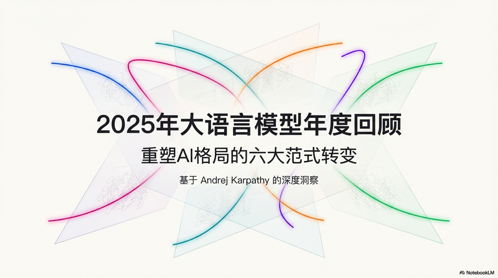

## 引言：重新校准你对 AI 的认知

2025 年，人工智能（AI）的发展速度令人瞠目结舌，几乎每天都有新的突破刷新我们的认
知。在信息洪流中，如何抓住真正的关键变革？为此，我们深入剖析了 AI 领域顶尖思想家
之一 Andrej Karpathy 的年终回顾，从中提炼出六个最令人惊讶、最具颠覆性的观点。这
些见解不仅是对过去一年技术进展的总结，更是帮助我们理解 AI 本质、洞察其未来走向的
“心智模型转变”（`paradigm changes`）。准备好，让我们一起重新校准对 AI 的认知。

---

## 核心观点

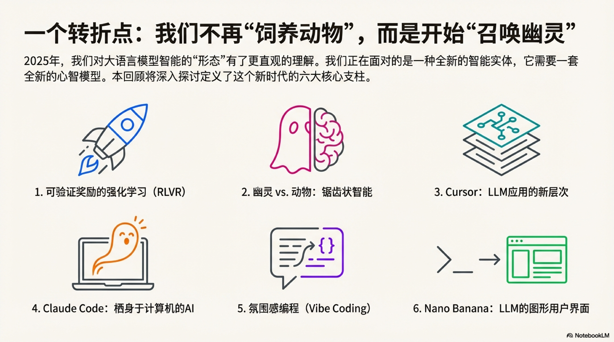

### 1. 可验证奖励强化学习（RLVR）：AI 学会了真正的“推理”

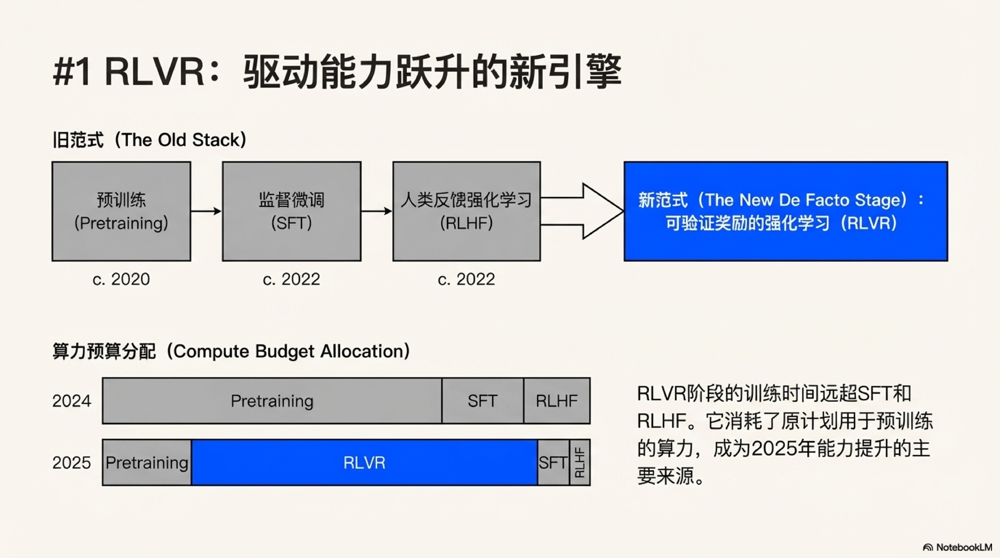

- 训练流程从三步曲演进为四阶段：`预训练` → `SFT` → `RLHF` → `RLVR`。
- `RLVR` 在可自动验证的环境（数学题、代码谜题）中进行长期优化，促生更强的推理。
- 模型从依赖人类的模糊反馈，转向基于客观“可验证奖励”的自我试错与迭代。
- 由此涌现出类人策略：将复杂问题分解为中间步骤、反复修正思路。
- 经济学层面的转变：极高的“能力/美元”效率，算力从预训练转向更长的 `RLVR` 阶段。
- 代表性节点：OpenAI 的 `o1` 是早期 `RLVR` 模型，而 2025 年初的 `o3` 能力提升肉
  眼可见。

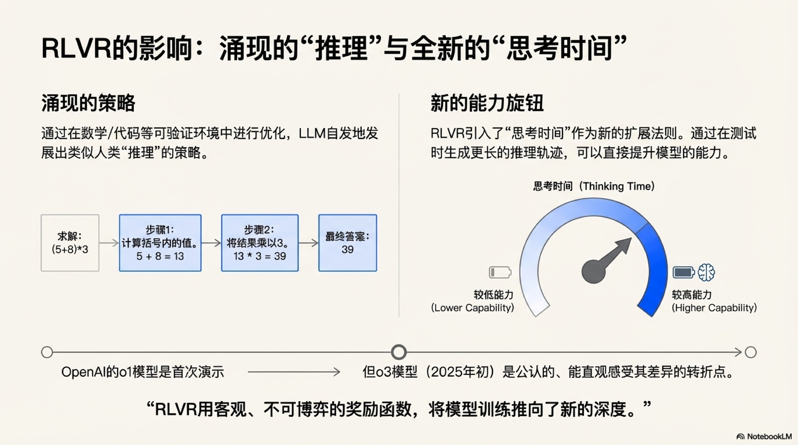

### 2. Ghost vs. 动物：我们正在召唤一种全新的“锯齿状”智能

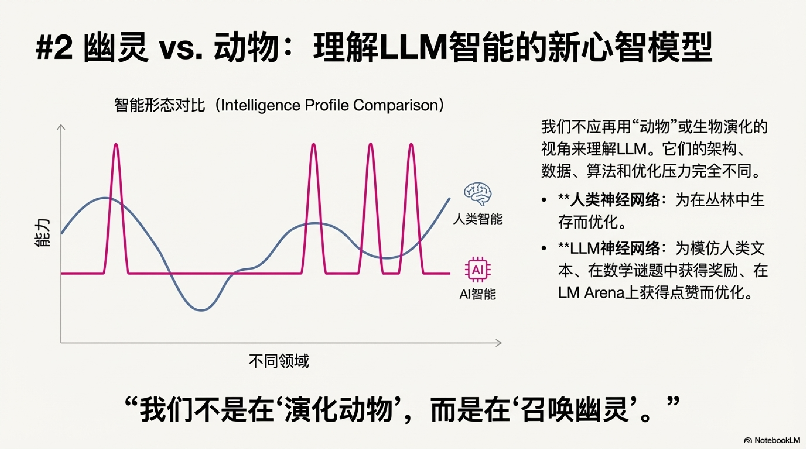

- `LLM` 的智能并非类人或类动物，而是“锯齿状”（`jagged`）：在可验证领域近乎全能，
  在其他方面则可能幼稚。
- 人类智能同样“锯齿”，但“锯齿形状”不同；这解释了模型在特定任务上的极端强弱。
- `RLVR` 让基准测试成为最完美、也最狭隘的优化目标，导致“应试训练”泛化。
- 对基准测试的信任度下降：在测试上长出“尖刺”，不等于通用智能真正提升。
- 发人深省的追问：在所有基准测试中都取得优异成绩但仍未实现 `AGI`，会是什么样子？

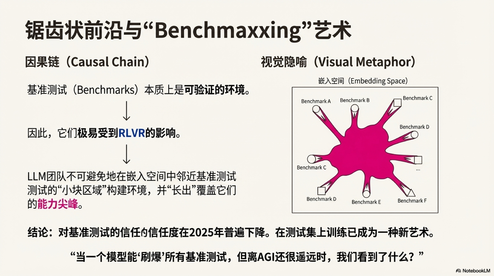

### 3. Cursor 的启示：LLM 应用迎来“厚中间层”时代

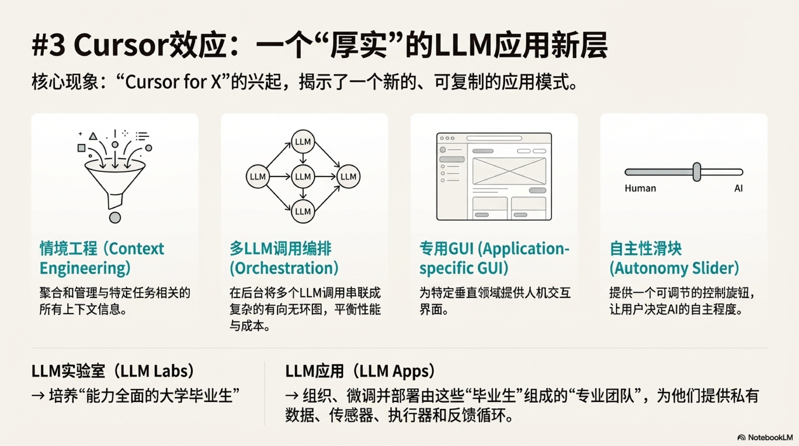

- 新一代应用不再是薄薄的 `API` 封装，而是具备强大的“上下文工程”与编排能力。
- 后端编排多次、多模型调用，动态平衡成本与性能。
- 针对特定领域优化的专用 `GUI`，提升交互与生产力。
- 为用户提供“自主性滑块”，可精准控制交给 AI 的决策权。
- 生态分工：基础模型像“能力全面的大学毕业生”，`Cursor` 等应用将其组织成“专业团
  队”，结合私有数据与工具形成差异化价值。

### 4. Claude Code：AI 开始“生活”在你的电脑上

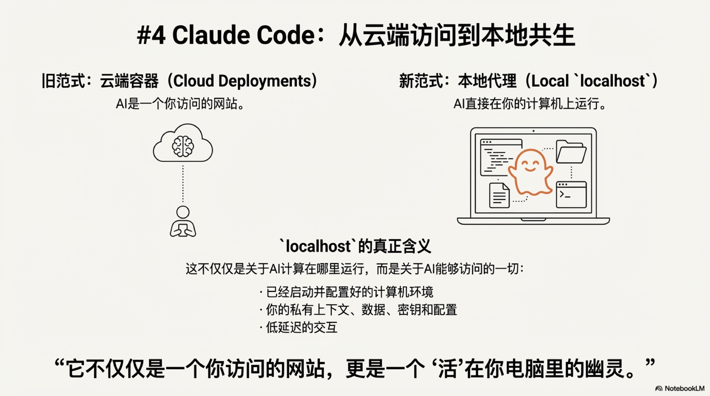

- Anthropic 的 `Claude Code` 被视为首个令人信服的本地 `Agent` 范例。
- 与早期云端容器的智能体不同，它在 `localhost` 运行，直接访问用户的环境、数据与
  上下文。
- 能力参差不齐的“中间阶段”，让“住在开发者电脑上的 AI”更有意义。
- 价值不只在算力，更在与既有工作流的无缝接入：安装、上下文、数据、密钥、配置与低
  延迟互动。

### 5. Vibe Coding：当编程变成一种“感觉”

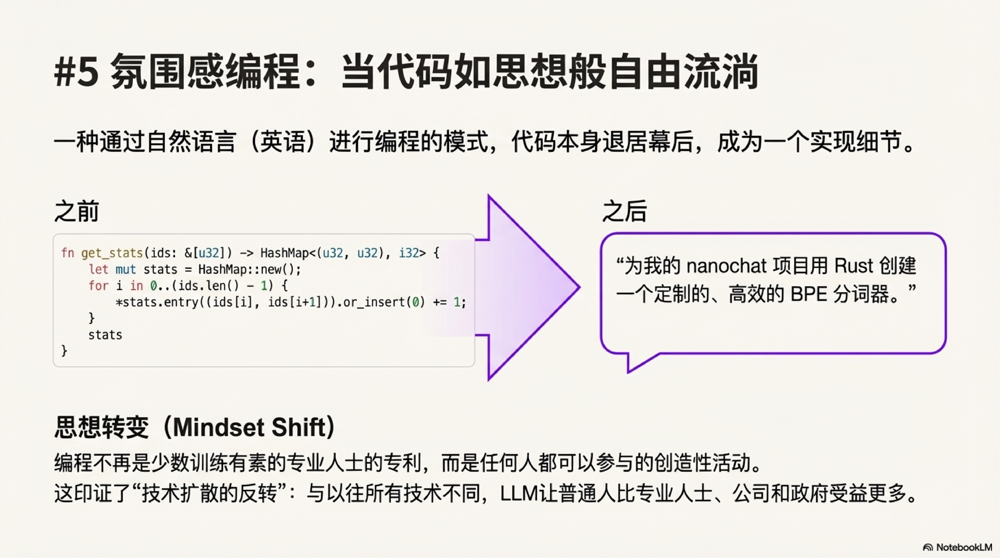

- 能力跨过关键门槛，任何人都能用自然语言“写程序”，甚至忽略底层代码。
- “权力归于人民”：`LLM` 正在改变技术扩散模式。
- 双重赋权：
  - 让非专业人士跨越门槛；
  - 让专业开发者以极低成本快速产出大量辅助工具与一次性应用。
- 在这一时代，代码变得“免费、短暂、可塑”，一次性使用后即可丢弃。
- Karpathy 本人用这种方式构建了 `BPE` 分词器与多个小型应用。

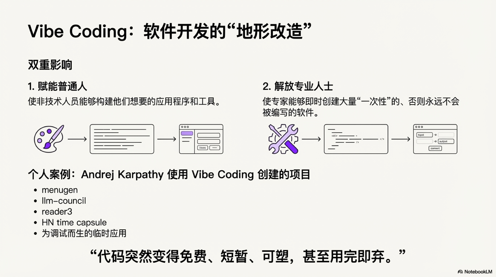

### 6. Nano Banana 与 LLM GUI：告别纯文字，迎接视觉化 AI

- 将 `LLM` 视作继个人电脑后的下一主要计算范式。
- 纯“聊天”就像 1980 年代的命令行；人类更偏好视觉化与空间化的信息组织。
- 因此 `LLM` 的未来必然走向 `GUI`：图像、信息图、幻灯片、动画、交互式应用。
- Google 的 `Gemini Nano banana` 是早期“`LLM GUI`”雏形：在模型权重中耦合文字生
  成、图像生成与世界知识，更直观且贴近人类认知。

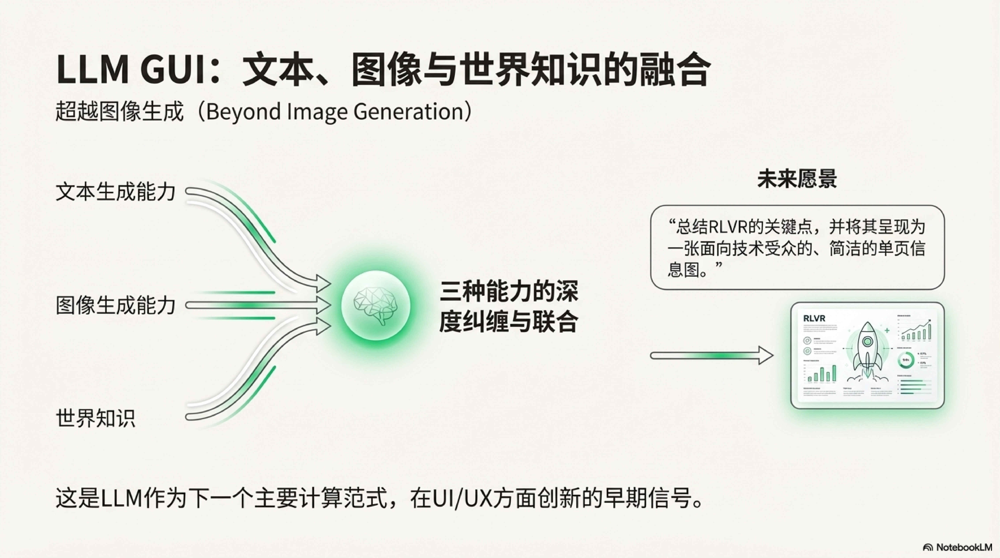

---

## 结论：在期望与现实之间，AI 的未来才刚刚开始

- `LLM` “比预期更聪明，也比预期更笨”——能力强大但仍远未触顶。
- 行业对其潜力的挖掘不到 10%，概念空间依旧开放，机会尚多。
- 我们既相信“会看到快速、持续的进步”，也承认“还有大量工作要做”。
- 这正是置身技术革命最真实、最激动人心的状态：AI 的未来，才刚刚开始。

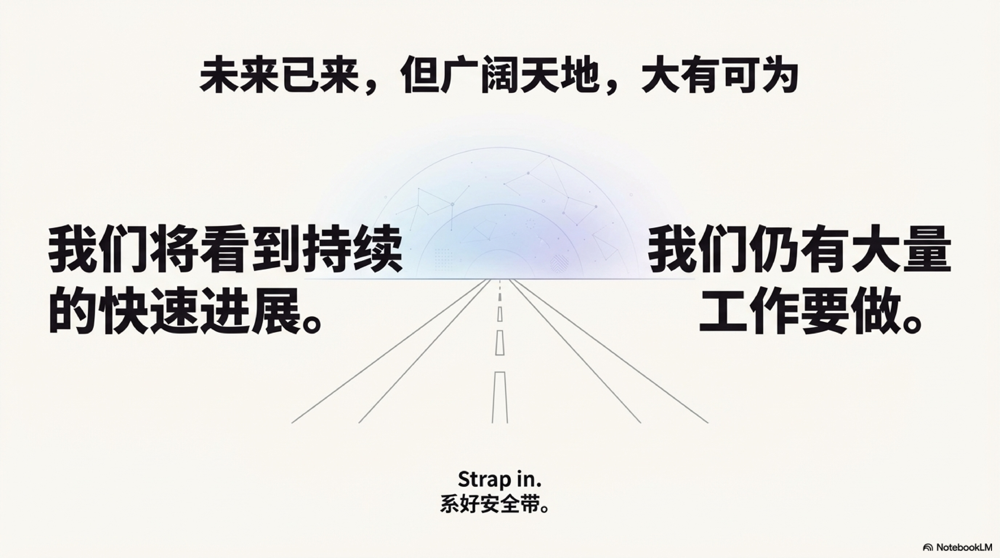

## 参考

- [2025 LLM Year in Review](https://karpathy.bearblog.dev/year-in-review-2025/)
