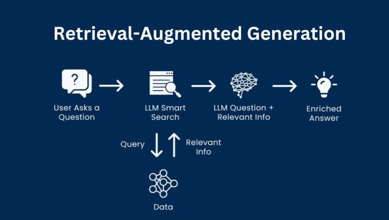
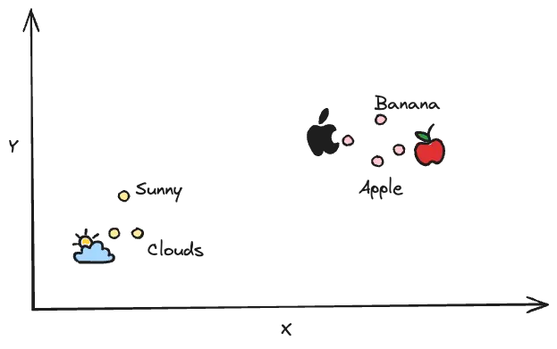
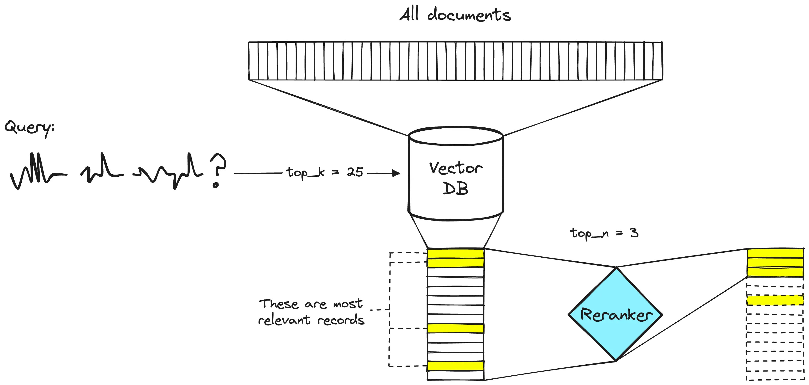

# RAG (Retrieval-Augmented Generation)

## What's RAG?

RAG stands for Retrieval-Augmented Generation. It is a technique used in natural
language processing (NLP) that combines retrieval-based methods with
generation-based methods. In RAG, a retrieval model is used to fetch relevant
documents or passages from a large corpus, and then a generation model (such as
a transformer-based language model) is used to generate a response or output
based on the retrieved information. This approach aims to improve the quality
and relevance of generated text by leveraging external knowledge sources.



## Why RAG?

RAG is needed because traditional generation models often struggle with
producing accurate and contextually relevant responses, especially when the
required information is not present in the training data. By incorporating a
retrieval mechanism, RAG can access up-to-date and specific information from
external sources, leading to more accurate and informative outputs. This is
particularly useful in applications like question answering, customer support,
and content creation, where the quality and relevance of the generated text are
crucial.

## Limitations of LLMs

Despite the strong capabilities of large language models (LLMs), they still have
some limitations:


1. **Knowledge Update Lag**: LLMs are typically trained on static datasets and
   may not reflect the most recent knowledge and information.
2. **Accuracy of Generated Content**: Without external knowledge, LLMs may
   generate inaccurate or irrelevant content.
3. **Limited Context Understanding**: LLMs may struggle with understanding long
   texts or complex contexts, leading to misinterpretations or missing key
   information.
4. **High Computational Resources**: Training and running LLMs require
   significant computational resources, which can be costly.
5. **Data Security Issues**: General LLMs do not have access to internal
   enterprise data and user data. To ensure security, enterprises may prefer to
   keep all data locally and perform business computations on-premises, while
   using online models only for summarization purposes.


## RAG processing

The RAG process involves two main steps: Indexing, retrieval and generation.

### **Indexing**




#### Garbage in, garbage out

- Chunking
- Select proper embeddings model
  - https://ollama.com/search?c=embedding&q=embedding
  - https://huggingface.co/spaces/mteb/leaderboard
- Vector DB
  - https://en.wikipedia.org/wiki/Vector_database

### **Retrieval**

In this step, a retrieval model is used to search a large corpus of documents or
passages to find the most relevant information based on the input query. This
model can be based on traditional information retrieval techniques or more
advanced neural retrieval models.

### **Generation**

Once the relevant documents or passages are retrieved, a generation model
(typically a transformer-based language model) takes this information and
generates a coherent and contextually relevant response or output. The
generation model leverages the retrieved information to enhance the quality
and accuracy of the generated text.

By combining these two steps, RAG can produce more accurate and contextually
appropriate responses, making it a powerful technique for various NLP
applications.

## Example code

```python
from langchain_openai import ChatOpenAI
from langchain_core.messages import SystemMessage, HumanMessage

# Define a system prompt that tells the model how to use the retrieved context
system_prompt = """You are an assistant for question-answering tasks.
Use the following pieces of retrieved context to answer the question.
If you don't know the answer, just say that you don't know.
Use three sentences maximum and keep the answer concise.
Context: {context}:"""

# Define a question
question = """What are the main components of an LLM-powered autonomous agent system?"""

# Retrieve relevant documents
docs = retriever.invoke(question)

# Combine the documents into a single string
docs_text = "".join(d.page_content for d in docs)

# Populate the system prompt with the retrieved context
system_prompt_fmt = system_prompt.format(context=docs_text)

# Create a model
model = ChatOpenAI(model="gpt-4o", temperature=0)

# Generate a response
questions = model.invoke([SystemMessage(content=system_prompt_fmt),
                          HumanMessage(content=question)])
```

## Reranking



## RAG Frameworks

- [RAGFlow](https://github.com/infiniflow/ragflow)
- [QAnything](https://github.com/netease-youdao/QAnything)
- [AnythingLLM](https://github.com/Mintplex-Labs/anything-llm)

## Production

- [Chat2DB](https://github.com/CodePhiliaX/Chat2DB)
- [Chatpdf](https://www.chatpdf.com/zh)

## iRAG


## [PaddlePaddle](https://github.com/PaddlePaddle/PaddleOCR/tree/main)

## [Graph RAG](https://microsoft.github.io/graphrag/)
