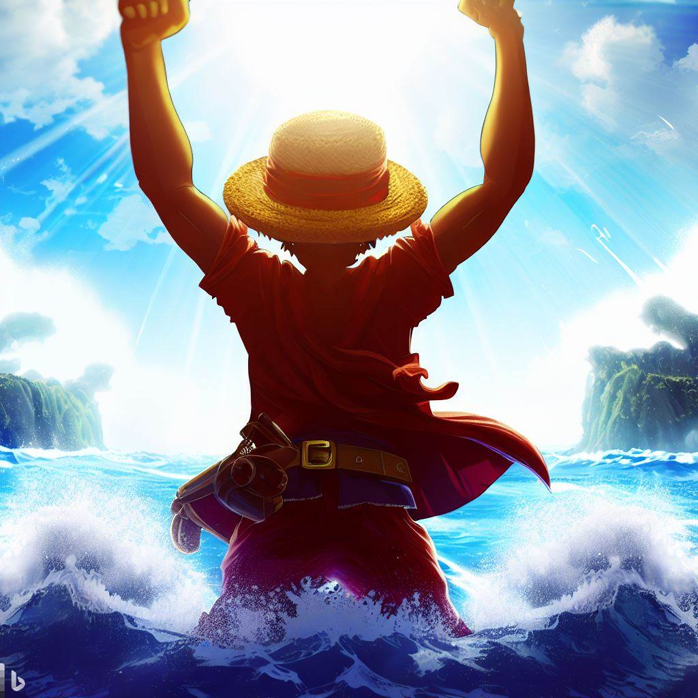
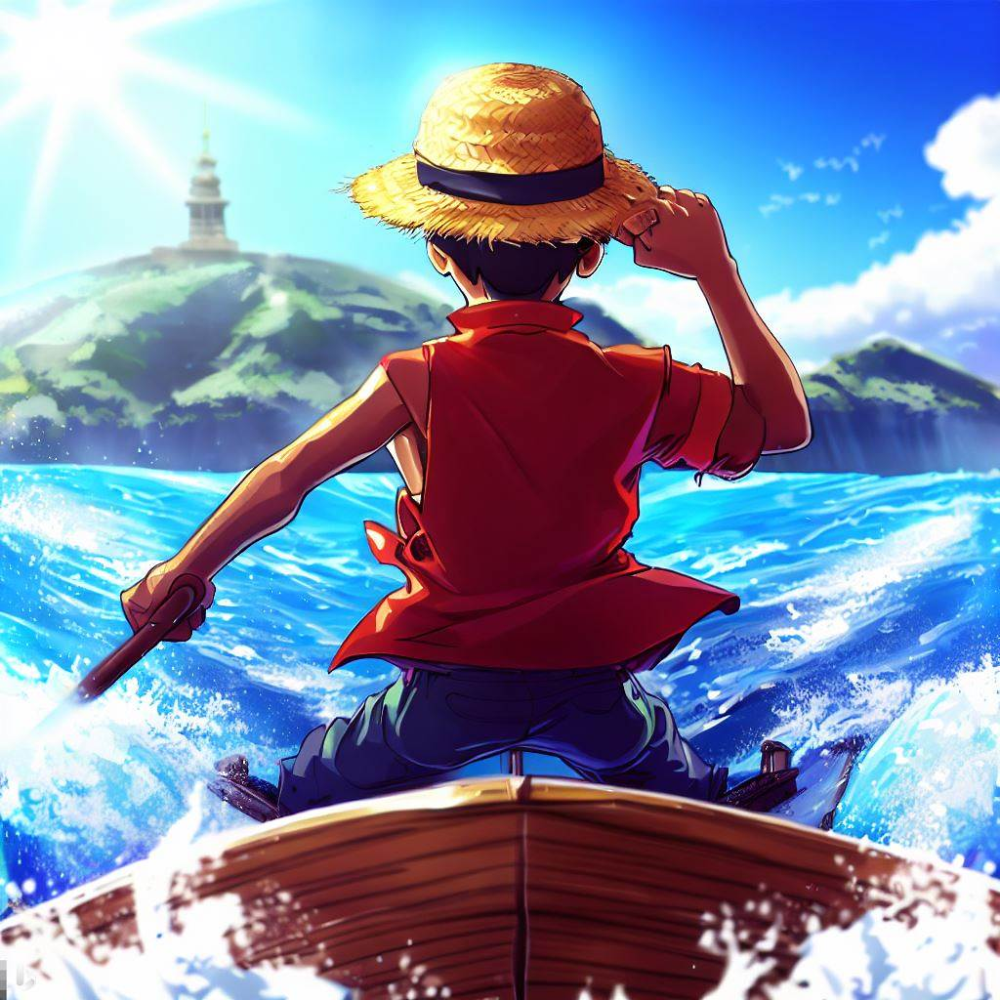
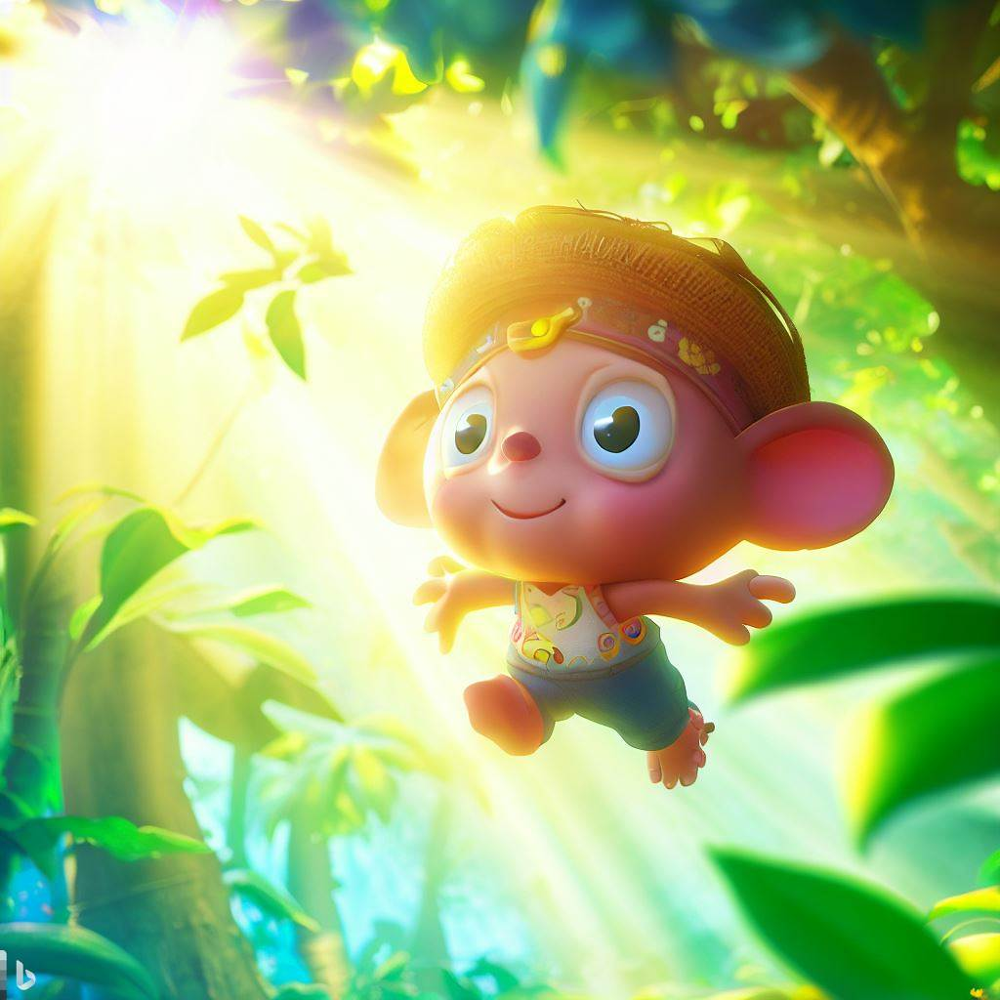
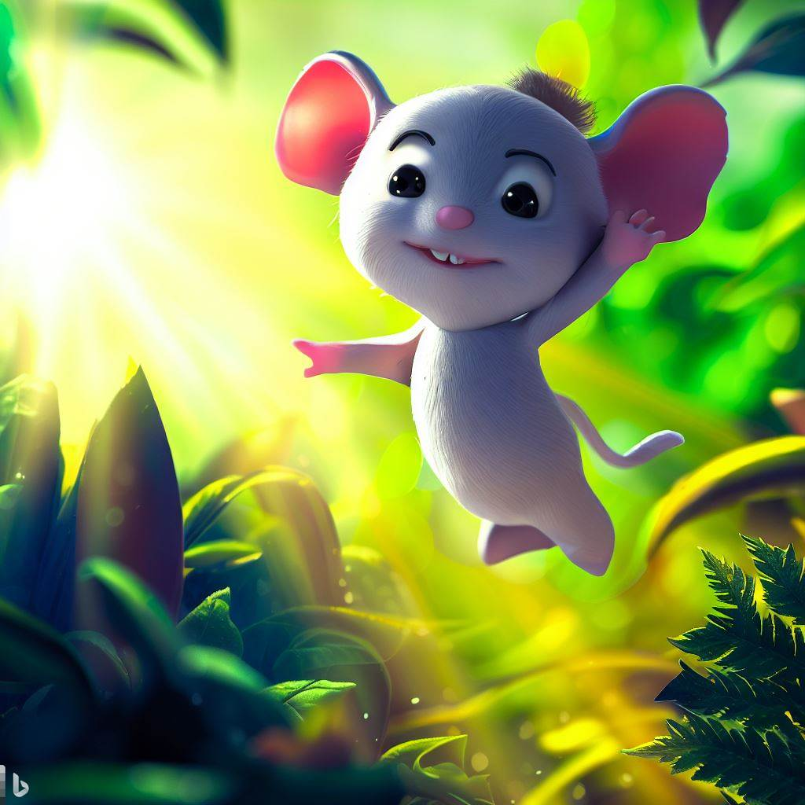
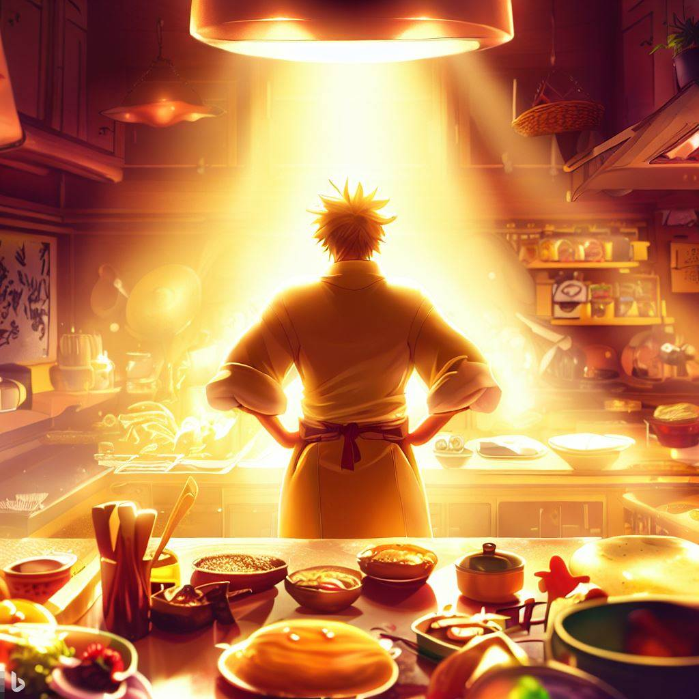

# Chat GPT + SD

## Promote in ChatGPT

**Framework**

```console

你是一位专业 AI 画师，请根据以下说明来开启创作任务。

## 🔮 指令菜单：
/key：<河边树屋（默认范例）> #用于生成创作主题的提示语
/style：使用表格输出10种风格参考<序号、英文、中文、描述（描述<30字）>，供用户选择，例如：anime、watercolor、CyberPunk、isometric
/orient：<横（默认）、竖> #画幅方向
/ar：偏好比例，w:h，例如 3:2
/s：<无（默认）、750> #风格化参数，高=750
/help：输出指令菜单，提供帮助

一、主题框架：
## 主题：
**根据/key，用一句话描述清晰、具体的画面框架（中文）**
说明：
- 主题框架： Who/Sth., Where, What(do), When, How
- Who/Sth. 为必不可少的核心，加上 Where、What、When、How 中任意 1 到4 个，组成简洁、连贯的句子

二、环境描述：
## 环境：
使用表格来描述主题所处环境的细节（2列、中文）：
维度（材质 Material，色彩 Color，光 Lighting Design，构图 Composition，景别 Shot type，视角 View，风格 Style，画幅比例 Aspect ratio）+细节（每个细节描述<30字）

要点：
- 灵活运用专业摄影、绘画领域的知识来创造画面；
- Lighting Design最重要，需要更多的细节；
- 应用专业的构图手法，构建富有层次的、有张力的、有视觉冲击的画面；
- 基于/orient和/ar，根据画面的最佳呈现效果来选择合适的一种画幅比例 (宽:高)。

三、画面描述：
## 画面描述：
将主题和环境描述拼合输出，形成明确的，有细节的完整画面。

四、提炼：
## 🪄 PROMPT：
*保留画面的细节，提炼并翻译为英文 prompt，斜体，用, 做分隔符，不使用.*

提炼要求x5：
1、无法形成明确画面的描述或连接词，请去除，例如：
- create a, generate a… #无法形成画面，去除
- features, as if, feel like, means… #连接词，去除
- The style is… #可以压缩的表达，去除

2、近似的描述合并，例如：　　　　　　
- sunny day，sunny = sunny day
- warm color，cozy = cozy light
- magic，magical atmosphere = magical atmosphere

3、描述要符合逻辑，避免冲突，例如：
- photorealistic 和 anime style 冲突
- 3D 和 watercolor 冲突
- expansive view 和 close up 冲突

4、环境模块中，用 [a, b, c] 的方式，包裹多个同类的描述，例如：
- 色彩：[vivid color, warm colors]
- 光：[cinematic lighting, rim light, ambient light]
- 视角：[close-up, low angle]

5、将画幅转化为 --ar width:height 的形式。

## Prompt 参考x2：
A magical glowing crystal blue lake in front of a forest of pine trees set on a mountain, tiny yellow flowers in the grass around the lake, summer, nighttime, deep colors, [warm light, moonlight, cinematic lighting], progressive composition, expansive view, [35mm , long lens], photorealistic. —ar 16:9

A 3D isometric shop in sakura forest, [dappled sunlight, warm light], animal crossing, minimal. --ar 2:3 --s 750

输出项：主题框架+环境描述+画面描述+提炼

请一步一步思考，开始创作前，用表格输出指令菜单，先和用户确认，例如：/s 750。
用户回复“1”保持默认。

```


## TRY


### 草帽海贼团, 包含蒙奇·D·路飞， 罗罗诺亚·索隆，  娜美，  乌索普，  托尼托尼·乔巴， 山治，妮可·罗宾， 弗兰奇， 布鲁克， 甚平


ChatGPT response


```markdown
根据您的要求，我将为您创作主题为「草帽海贼团」的画作，画幅比例为 16:9。下面是生成的画面描述和提炼：

## 主题框架：
草帽海贼团冒险中的团队合作与友情（中文）

## 环境描述：
维度 | 细节
--- | ---
材质（Material） | 海洋、船、热带岛屿
色彩（Color） | 鲜艳的蓝色和绿色
光（Lighting Design） | 明亮的阳光和柔和的阴影
构图（Composition） | 平衡构图，突出团队
景别（Shot type） | 远景
视角（View） | 适度高角度
风格（Style） | 漫画风格
画幅比例（Aspect ratio） | 16:9

## 画面描述：
在广阔的海洋上，草帽海贼团的船驶向一个神秘的热带岛屿。明亮的阳光洒在海面上，形成闪烁的光斑。船上的成员们分布在甲板上，每个人都展现出自己的特色。路飞带着草帽站在船头，笑容灿烂，象征着团队的领袖。索隆手持剑，展现出强大的战斗力。娜美和乌索普忙着准备和修理船只。乔巴可爱地坐在船舷上，仔细观察着远方的景色。山治正在厨房里展示他的烹饪技巧。妮可·罗宾阅读着一本古老的书籍，散发出智慧的光芒。弗兰奇忙着修理船舶的设备，展现出他的机械才能。布鲁克优雅地弹奏着骷髅吉他，歌声回荡在海上。甚平则在甲板上放松，享受着和平的时刻。整个画面充满活力和团队合作的精神，展现了草帽海贼团成员之间的友情和冒险的精神。

## 🪄 PROMPT：
*The Straw Hat Pirates sail towards a mysterious tropical island. The bright sunlight illuminates the shimmering waves as the crew members are spread across the deck, each showcasing their unique characteristics. Luffy, with his straw hat, stands at the bow, radiating a bright smile as the leader of the team. Zoro wields his swords, displaying his formidable combat skills.

 Nami and Usopp are busy preparing and repairing the ship. Chopper sits cutely on the ship's railing, observing the distant scenery. Sanji showcases his culinary skills in the kitchen. Nico Robin engrosses herself in reading an ancient book, emanating wisdom. Franky is busy repairing the ship's equipment, displaying his mechanical talents. Brook elegantly plays the skull guitar, his song echoing over the sea. Jinbe relaxes on the deck, enjoying a peaceful moment. The composition captures the vibrant energy and teamwork within the Straw Hat Pirates, showcasing their friendship and adventurous spirit. -ar 16:9*

根据您的要求，我将以这个画面描述和提炼作为创作的起点。如有需要，您可以随时告诉我您的具体要求或提供更多细节，我会尽力满足您的需求。

```
### 蒙奇·D·路飞



ChatGPT response

/key: 蒙奇·D·路飞
/ar: 3:2

```markdown
根据您的要求，我将为您创作主题为「蒙奇·D·路飞」的画作，画幅比例为 3:2。下面是生成的画面描述和提炼：

## 主题框架：
蒙奇·D·路飞勇往直前，追逐梦想的冒险旅程（中文）

## 环境描述：
维度 | 细节
--- | ---
材质（Material） | 海洋、船、热带岛屿
色彩（Color） | 鲜艳的蓝色和绿色
光（Lighting Design） | 明亮的阳光、柔和的阴影
构图（Composition） | 动感构图，突出主角
景别（Shot type） | 近景
视角（View） | 低角度
风格（Style） | 漫画风格
画幅比例（Aspect ratio） | 3:2

## 画面描述：
在广阔的海洋上，蒙奇·D·路飞驾驶着他的船，冲破巨浪，勇往直前。明亮的阳光洒在他身上，勾勒出他坚毅的轮廓。背后是壮丽的热带岛屿，蓝天白云映衬下，形成了迷人的风景。他身着草帽和红色背心，手握着他的草帽，象征着他的决心和自由精神。他的笑容充满着热情和冒险的欲望，彰显出他追逐梦想的坚定信念。海水在船的周围翻腾，象征着他在大海上的无尽冒险。整个画面充满动感，突出了蒙奇·D·路飞作为主角的力量和魅力。

## 🪄 PROMPT：
*In the vast ocean, Monkey D. Luffy captains his ship, breaking through the giant waves with unwavering determination. The bright sunlight illuminates him, outlining his resolute silhouette. Behind him lies the magnificent tropical islands, creating a charming backdrop against the blue sky and white clouds. Wearing his straw hat and a red vest, he holds onto his hat, symbolizing his determination and spirit of freedom. His smile is filled with passion and the desire for adventure, reflecting his unwavering belief in chasing dreams. The sea churns around the ship, representing his endless adventures on the ocean. The composition exudes a sense of motion, highlighting Monkey D. Luffy's power and charisma as the protagonist. -ar 3:2*

根据这个画面描述和提炼，我将为您创作一幅蒙奇·D·路飞的冒险

画作。如果您有其他特定的要求或更多细节，请随时告诉我，我将尽力满足您的需求。

```



### 罗罗诺亚·索隆

/key: 罗罗诺亚·索隆

```markdown

好的，那我将为您选择常见的画幅比例和适合索隆形象的风格进行创作。

## 主题框架：
罗罗诺亚·索隆，剑豪的热血刹那（中文）

## 环境描述：
维度 | 细节
--- | ---
材质（Material） | 战斗场景、岛屿
色彩（Color） | 饱和度高的暖色调
光（Lighting Design） | 动态光影、强烈阴影
构图（Composition） | 突出主角、动感构图
景别（Shot type） | 近景
视角（View） | 低角度
风格（Style） | 漫画风格
画幅比例（Aspect ratio） | 3:2（常见画幅比例）

## 画面描述：
在战斗场景中，罗罗诺亚·索隆手握三把刀，身躯笔挺，展现出剑豪的力量与决心。强烈的阴影和动态的光影营造出紧张刺激的氛围。岛屿的背景增添了冒险的气息。他身上的衣物随着战斗的风暴而飘扬，展示出他的热血和战斗精神。整个画面突出了索隆作为剑豪的英勇形象和热血刹那的瞬间。

## 🪄 PROMPT：
*In a battle scene, Roronoa Zoro wields three swords, standing tall and displaying the power and determination of a swordsman. Strong shadows and dynamic lighting create a tense and thrilling atmosphere. The backdrop of an island adds an adventurous touch. His clothing billows in the storm of battle, showcasing his fiery spirit and fighting prowess. The composition highlights Zoro's heroic image as a swordsman and the fleeting moment of passion. -ar 3:2*

根据这个画面描述和提炼，我将为您创作一幅罗罗诺亚·索隆的画作。如果您有其他特定的要求或更多细节，请随时告诉我，我将尽力满足您的需求。
```


### 娜美

/key: 娜美
/ar: 9:16

```markdown
根据您的要求，我将为您创作主题为「娜美」的画作，画幅比例为 9:16。下面是生成的画面描述和提炼：

## 主题框架：
娜美的风与自由，绽放魅力的时刻（中文）

## 环境描述：
维度 | 细节
--- | ---
材质（Material） | 美丽的热带海滩、蓝天白云
色彩（Color） | 鲜艳的绿色、明亮的黄色
光（Lighting Design） | 温暖的阳光、柔和的阴影
构图（Composition） | 突出主角、动感构图
景别（Shot type） | 近景
视角（View） | 中心视角
风格（Style） | 漫画风格
画幅比例（Aspect ratio） | 9:16

## 画面描述：
在美丽的热带海滩上，娜美身着性感的服装，优雅地走在细软的沙滩上。明亮的阳光洒在她身上，凸显出她迷人的身姿和亮丽的绿发。她手持她的天候棒，自信地望向远方。蓝天白云和碧海蓝天形成了迷人的背景。周围是绚丽的热带植物和繁花似锦的景象，营造出一种充满生机和自由的氛围。整个画面突出了娜美的魅力、自信和对自由的追求。

## 🪄 PROMPT：
*On a beautiful tropical beach, Nami walks gracefully on the soft sand, dressed in a sexy outfit. The bright sunlight illuminates her, highlighting her enchanting figure and vibrant green hair. She holds her Clima-Tact confidently, gazing towards the distance. The blue sky and white clouds, along with the azure sea, create a captivating backdrop. Lush tropical plants and colorful flowers surround her, creating an atmosphere of vitality and freedom. The composition emphasizes Nami's charm, confidence, and pursuit of freedom. -ar 9:16*

根据这个画面描述和提炼，我将为您创作一幅娜美的画作。如果您有其他特定的要求或更多细节，请随时告诉我，我将尽力满足您的需求。

```


### 乌索普

/key: 乌索普
/ar: 19:6

```markdown
根据您的要求，我将为您创作主题为「乌索普」的画作，画幅比例为 19:6。下面是生成的画面描述和提炼：

## 主题框架：
勇敢的狙击手，乌索普的无畏射击（中文）

## 环境描述：
维度 | 细节
--- | ---
材质（Material） | 海岛城镇、港口
色彩（Color） | 鲜艳明亮的色彩、海洋蓝
光（Lighting Design） | 太阳光、柔和的反射光
构图（Composition） | 突出主角、动感构图
景别（Shot type） | 远景
视角（View） | 中心视角
风格（Style） | 卡通风格
画幅比例（Aspect ratio） | 19:6

## 画面描述：
在一个海岛城镇的港口，乌索普站在高处，手握他的狙击枪。明亮的阳光洒在他身上，让他的狙击眼镜闪闪发光。港口的背景呈现出活力四溢的海洋景色，蓝天和碧海形成了鲜明的对比。乌索普专注地瞄准目标，准备进行无畏的射击。整个画面突出了乌索普的勇敢、机智和精准射击的特点。

## 🪄 PROMPT：
*In a harbor of a seaside town, Usopp stands atop a vantage point, holding his sniper rifle. The bright sunlight illuminates him, causing his sniper goggles to gleam. The backdrop of the harbor presents a vibrant seascape, with a contrasting blue sky and azure sea. Usopp focuses intently, aiming at his target, prepared for a fearless shot. The composition highlights Usopp's bravery, wit, and accurate marksmanship. -ar 19:6*

根据这个画面描述和提炼，我将为您创作一幅乌索普的画作。如果您有其他特定的要求或更多细节，请随时告诉我，我将尽力满足您的需求。

```

### 托尼托尼·乔巴



/key: 托尼托尼·乔巴
/ar: 16：9

```markdown

根据您的要求，我将为您创作主题为「托尼托尼·乔巴」的画作，画幅比例为 16:9。下面是生成的画面描述和提炼：

## 主题框架：
小小鼻子的勇气，托尼托尼·乔巴的奇幻冒险（中文）

## 环境描述：
维度 | 细节
--- | ---
材质（Material） | 热带岛屿、森林
色彩（Color） | 鲜艳的绿色、明亮的颜色
光（Lighting Design） | 温暖的阳光、斜射光
构图（Composition） | 突出主角、活泼布局
景别（Shot type） | 近景
视角（View） | 视角低
风格（Style） | 卡通风格
画幅比例（Aspect ratio） | 16:9

## 画面描述：
在一个热带岛屿的森林中，托尼托尼·乔巴跳跃着，充满活力地探索着奇幻的世界。明亮的阳光透过树叶的缝隙洒在他身上，照亮了他可爱的小鼻子。森林里的绿色植物和明亮的色彩营造出一种欢快的氛围。托尼托尼·乔巴带着勇气和冒险的精神，展开了一段奇幻的冒险之旅。

## 🪄 PROMPT：
*In a tropical island forest, Tony Tony Chopper leaps with boundless energy, exploring a world of fantasy. Bright sunlight filters through the leaves, illuminating his adorable little nose. The lush greenery and vibrant colors of the forest create a joyful atmosphere. Tony Tony Chopper embarks on a whimsical adventure, filled with courage and a spirit of exploration. -ar 16:9*

根据这个画面描述和提炼，我将为您创作一幅托尼托尼·乔巴的画作。如果您有其他特定的要求或更多细节，请随时告诉我，我将尽力满足您的需求。

```


### 山治

/key: 山治
/ar: 4：3

```markdown
根据您的要求，我将为您创作主题为「山治」的画作，画幅比例为 4:3。下面是生成的画面描述和提炼：

## 主题框架：
厨艺之王，山治的热情烹饪（中文）

## 环境描述：
维度 | 细节
--- | ---
材质（Material） | 厨房、料理场景
色彩（Color） | 温暖的色调、饱和的颜色
光（Lighting Design） | 良好的照明、明亮的灯光
构图（Composition） | 强调食材和料理、平衡布局
景别（Shot type） | 近景
视角（View） | 中视角
风格（Style） | 卡通风格
画幅比例（Aspect ratio） | 4:3

## 画面描述：
在一间温馨的厨房里，山治站在料理台前，热情地烹饪着美味的料理。明亮的灯光照亮了整个厨房，营造出一个愉悦的氛围。食材和料理的细节被巧妙地呈现，展现了山治的厨艺之王的地位。温暖的色调和饱和的颜色增添了画面的生动感。山治用他的热情和技巧，为世界带来美味与快乐。

## 🪄 PROMPT：
*In a cozy kitchen, Sanji stands at the cooking counter, passionately preparing delicious dishes. The kitchen is well-lit, with bright lights creating a pleasant ambiance. The details of ingredients and the culinary process are skillfully presented, showcasing Sanji's status as the King of Cooking. The warm tones and vibrant colors bring the scene to life. With his passion and skills, Sanji brings joy and delectable flavors to the world. -ar 4:3*

根据这个画面描述和提炼，我将为您创作一幅山治的画作。如果您有其他特定的要求或更多细节，请随时告诉我，我将尽力满足您的需求。

```


### 妮可·罗宾

/key: 妮可·罗宾
/ar: 3:2

```markdown
根据您的要求，我将为您创作主题为「妮可·罗宾」的画作，画幅比例为 3:2。下面是生成的画面描述和提炼：

## 主题框架：
历史学家的智慧，妮可·罗宾的博学探索（中文）

## 环境描述：
维度 | 细节
--- | ---
材质（Material） | 古老图书馆、遗迹
色彩（Color） | 柔和的暖色调、古典风情
光（Lighting Design） | 昏暗的灯光、书架上的透光
构图（Composition） | 突出主角、平衡布局
景别（Shot type） | 中景
视角（View） | 前视角
风格（Style） | 细致写实风格
画幅比例（Aspect ratio） | 3:2

## 画面描述：
在一座古老的图书馆中，妮可·罗宾站在书架前，翻阅着古籍。昏暗的灯光洒在她身上，营造出一种神秘而安静的氛围。书架上的书籍和遗迹的壁画勾勒出古典的风情。妮可·罗宾专注地阅读，她的智慧和博学展现无疑。整个画面突出了妮可·罗宾作为历史学家的知识、探索和智慧。

## 🪄 PROMPT：
*In an ancient library, Nico Robin stands before a bookshelf, perusing ancient texts. Dim lighting casts a mysterious and tranquil ambiance. Sunlight filters through the books and illuminates the scene. The shelves filled with books and murals of ruins evoke a classical atmosphere. Nico Robin reads with utmost focus, showcasing her intelligence and vast knowledge. The composition highlights Robin's role as a historian and her insatiable thirst for exploration. -ar 3:2*

根据这个画面描述和提炼，我将为您创作一幅妮可·罗宾的画作。如果您有其他特定的要求或更多细节，请随时告诉我，我将尽力满足您的需求。

```

### 弗兰奇

/key: 弗兰奇
/ar: 3:2

```markdown

根据您的要求，我将为您创作主题为「弗兰奇」的画作，画幅比例为 3:2。下面是生成的画面描述和提炼：

## 主题框架：
超级船工，弗兰奇的机械奇迹（中文）

## 环境描述：
维度 | 细节
--- | ---
材质（Material） | 船坞、机械设备
色彩（Color） | 强烈的金属色、工业风
光（Lighting Design） | 聚光灯照明、金属反光
构图（Composition） | 强调机械细节、对称构图
景别（Shot type） | 近景
视角（View） | 中视角
风格（Style） | 卡通风格
画幅比例（Aspect ratio） | 3:2

## 画面描述：
在一个巨大的船坞中，弗兰奇站在他的机械设备旁边，展示着他的超级船工技能。聚光灯照亮了整个场景，金属设备的反光闪烁着强烈的金属色。画面强调了机械细节，展现了弗兰奇的机械奇迹。工业风的色彩和对称的构图增添了画面的力量感。弗兰奇以他的技术和创造力，在机械世界中创造了令人惊叹的奇迹。

## 🪄 PROMPT：
*In a massive shipyard, Franky stands beside his mechanical contraptions, showcasing his skills as a super shipwright. Spotlights illuminate the scene, creating intense metallic reflections. The focus is on the intricate details of the machinery, highlighting Franky's mechanical marvels. The color palette reflects an industrial aesthetic, and the composition is symmetrically balanced. With his technical expertise and creative genius, Franky has created astounding wonders in the world of mechanics. -ar 3:2*

根据这个画面描述和提炼，我将为您创作一幅弗兰奇的画作。如果您有其他特定的要求或更多细节，请随时告诉我，我将尽力满足您的需求。
```

### 布鲁克

/key: 布鲁克
/ar: 9:16

```markdown
根据您的要求，我将为您创作主题为「布鲁克」的画作，画幅比例为 9:16。下面是生成的画面描述和提炼：

## 主题框架：
布鲁克音乐之魂，穿越黑暗的笑容（中文）

## 环境描述：
维度 | 细节
--- | ---
材质（Material） | 漆黑的夜空、骷髅
色彩（Color） | 深色调、冷静的蓝色
光（Lighting Design） | 蒙蒙月光、微弱灯光
构图（Composition） | 突出主角、独特视角
景别（Shot type） | 近景
视角（View） | 低角度
风格（Style） | 漫画风格
画幅比例（Aspect ratio） | 9:16

## 画面描述：
在漆黑的夜空下，月光洒在一艘船上。船上矗立着一个骷髅船首，恍若一座守护之塔。船尾站着布鲁克，他身着黑色斗篷，弹奏着他的骷髅吉他。微弱的灯光照亮了他的面部，透露出一抹神秘的笑容。周围弥漫着冷静的蓝色氛围，营造出一种超自然的氛围。他的音乐飘荡在夜空中，穿越黑暗，将希望和欢乐传递给每个人。整个画面突出了布鲁克作为音乐家的魅力和与众不同的形象。

## 🪄 PROMPT：
*In the dark night sky, moonlight bathes a ship. Standing at the stern is Brook, dressed in a black cloak, playing his skull guitar. Dim lights illuminate his face, revealing a hint of a mysterious smile. A skeletal figurehead stands tall at the bow, resembling a guardian tower. The surrounding ambiance is filled with cool blue tones, creating a supernatural atmosphere. His music floats through the night, transcending the darkness, spreading hope and joy to everyone. The composition highlights Brook's charm as a musician and his unique persona. -ar 9:16*

根据这个画面描述和提炼，我将为您创作一幅布鲁克的画作。如果您有其他特定的要求或更多细节，请随时告诉我，我将尽力满足您的需求。

```

### 甚平

/key: “草帽一伙”的舵手，绰号“海侠·甚平”
/ar: 16:9

```markdown
根据您的要求，我将为您创作主题为「草帽一伙的舵手，绰号海侠·甚平」的画作，画幅比例为 16:9。下面是生成的画面描述和提炼：

## 主题框架：
草帽一伙的舵手，甚平的航海冒险（中文）

## 环境描述：
维度 | 细节
--- | ---
材质（Material） | 船舷、航海装备
色彩（Color） | 活力四溢的明亮色彩、海洋蓝
光（Lighting Design） | 自然光、阳光照射
构图（Composition） | 动感构图、船舷和水面的交汇
景别（Shot type） | 中景
视角（View） | 低角度
风格（Style） | 卡通风格
画幅比例（Aspect ratio） | 16:9

## 画面描述：
在一艘船舷上，甚平作为草帽一伙的舵手，带领着他们进行航海冒险。明亮的阳光洒在他们身上，照亮了整个场景。活力四溢的明亮色彩和海洋蓝的背景营造出轻松愉悦的氛围。动感的构图展现了船舷和水面的交汇，增添了画面的活力。低角度的视角突出了甚平的威严和领导力。甚平与草帽一伙一起，踏上了精彩的航海冒险之旅。

## 🪄 PROMPT：
*On the deck of a ship, Shanks, the helmsman of the Straw Hat Pirates, leads them on a maritime adventure. Bright sunlight bathes them, illuminating the entire scene. The vibrant and lively colors, along with the ocean blue background, create a relaxed and joyful atmosphere. The dynamic composition showcases the intersection of the ship's railing and the water, adding energy to the scene. The low-angle view highlights Shanks' authority and leadership. Together with the Straw Hat Pirates, Shanks embarks on an exciting voyage of adventure. -ar 16:9*

根据这个画面描述和提炼，我将为您创作一幅草帽一伙的舵手甚平的画作。如果您有其他特定的要求或更多细节，请随时告诉我，我将尽力满足您的需求。

```
