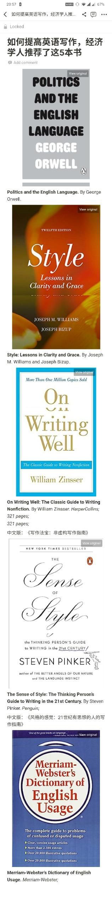

# Reading Notes

## 五本提高英文写作技能的必读书

- Politics and the English Language
- Style - Lessons in Clarity and Grace
- [On Writing Well](./on_writing_well.md)
- The Sense of Style: The Thinking Person’s Guide to Writing in the 21st Century
- Merriam-Webster's Dictionary of English Usage (MWDEU)

## Handbook of Technical Writing

## [Powerful](./powerful.md)
