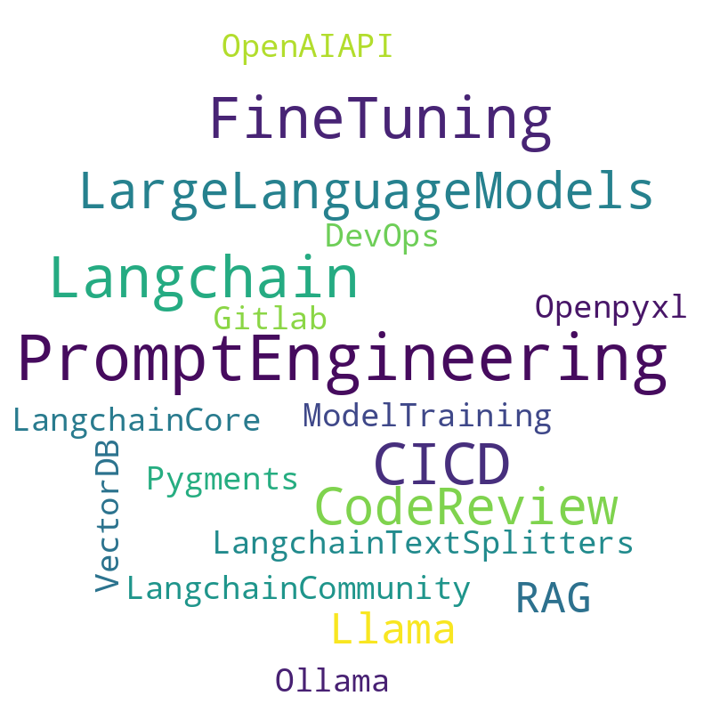

# Building an AI Application from Scratch

## Knowledge Tree

[AI engineer](https://roadmap.sh/ai-engineer)

## Iceberg Model

## 1. AI Code Review Robot

## 2. Identifying the Goal and Analyzing Requirements

- **Goal Definition**

- **User Groups**

- **Requirements**

## 3. Data Collection and Preparation

- **Data Sources**

- **Preprocessing Steps**

## 4. Selecting Technology

### **Model Development**

1. **Choose a Pre-trained Model**
2. **Fine-tune the Model**

## 5. System Integration and Deployment

### **System Architecture**

- **Frontend**
- **Backend**
- **Database**

### **Integration**

### **Deployment**

## 6. Monitoring and Continuous Optimization

### **Monitoring**

- Real-time logging to identify failures and bottlenecks.
- Metrics:
  - Response time.
  - Accuracy of suggestions.

### **Continuous Improvement**

- Regular updates to the model with new data.
- Expand support for more programming languages.
- Collect user feedback for better recommendations.

## 7. Key Takeaways

- Split code into smaller chunks.
- Add line numbers to code snippets.
- Twice review
  - First for review code
  - Second for review comments validation
- Use [reviewdog](https://github.com/reviewdog/reviewdog) helps to summit the comments to the PR.

## 8. Cost

## 9. Closing Thoughts

What will AI change in the future?
