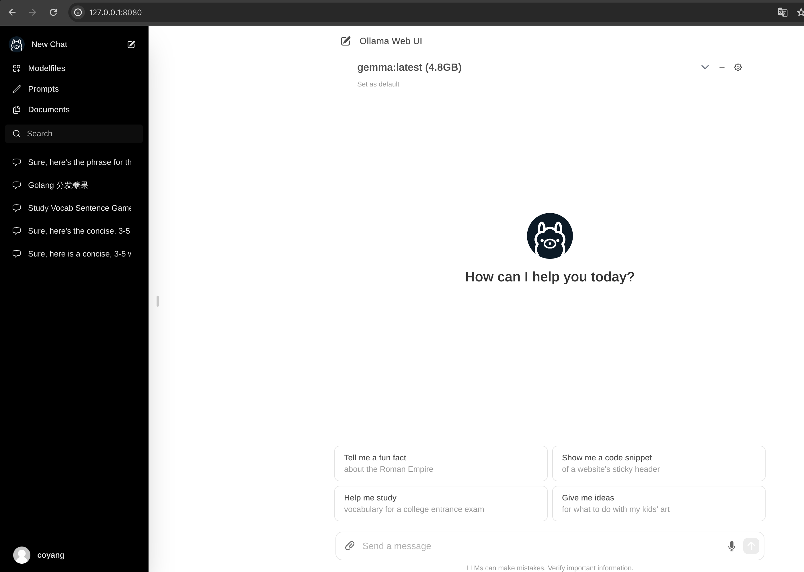

# Local deploy Laama

## Step by step

```bash
sudo dnf install snapd
sudo ln -s /var/lib/snapd/snap /snap
sudo snap install ollama --beta
sudo snap install ollama-webui --beta


ollama run gemma:2b
ollama pull gemma
ollama pull orca2
ollama pull orca2:13b
ollama pull starcoder
ollama pull starcoder:7b
ollama pull neural-chat
ollama pull neural-chat:7b
ollama pull neural-chat:7b-v3.3-fp16
ollama pull openchat
ollama pull tinyllama
ollama pull openhermes
ollama pull llama2-chinese
ollama pull llama2-chinese:13b
ollama pull zephyr
ollama pull wizard-vicuna-uncensored:30b
ollama pull wizard-vicuna-uncensored
ollama pull wizard-vicuna-uncensored:13b
ollama pull dolphin-mistral:v2.6
ollama pull orca-mini:13b
ollama pull phi
ollama pull nous-hermes2
ollama pull llava
ollama pull mixtral
ollama pull qwen:7b
ollama pull mistral-openorca
ollama pull codellama
ollama pull codellama:13b
ollama pull llama2:13b
ollama pull neural-chat
ollama pull llava
ollama pull mistral
ollama pull stable-code:3b-code-fp16

```

## Web UI



## References

- https://github.com/open-webui/open-webui
- https://ollama.com/
