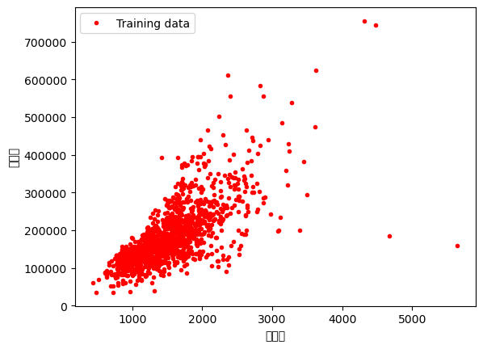
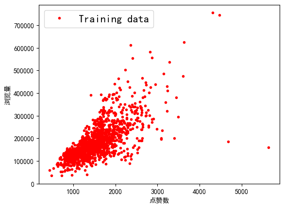

# Fix Chinese display issue

## Problem description

```bash
/home/coyang/anaconda3/lib/python3.10/site-packages/IPython/core/pylabtools.py:152: UserWarning: Glyph 28857 (\N{CJK UNIFIED IDEOGRAPH-70B9}) missing from current font.
  fig.canvas.print_figure(bytes_io, **kw)
/home/coyang/anaconda3/lib/python3.10/site-packages/IPython/core/pylabtools.py:152: UserWarning: Glyph 36190 (\N{CJK UNIFIED IDEOGRAPH-8D5E}) missing from current font.
  fig.canvas.print_figure(bytes_io, **kw)
/home/coyang/anaconda3/lib/python3.10/site-packages/IPython/core/pylabtools.py:152: UserWarning: Glyph 25968 (\N{CJK UNIFIED IDEOGRAPH-6570}) missing from current font.
  fig.canvas.print_figure(bytes_io, **kw)
/home/coyang/anaconda3/lib/python3.10/site-packages/IPython/core/pylabtools.py:152: UserWarning: Glyph 27983 (\N{CJK UNIFIED IDEOGRAPH-6D4F}) missing from current font.
  fig.canvas.print_figure(bytes_io, **kw)
/home/coyang/anaconda3/lib/python3.10/site-packages/IPython/core/pylabtools.py:152: UserWarning: Glyph 35272 (\N{CJK UNIFIED IDEOGRAPH-89C8}) missing from current font.
  fig.canvas.print_figure(bytes_io, **kw)
/home/coyang/anaconda3/lib/python3.10/site-packages/IPython/core/pylabtools.py:152: UserWarning: Glyph 37327 (\N{CJK UNIFIED IDEOGRAPH-91CF}) missing from current font.
  fig.canvas.print_figure(bytes_io, **kw)
```

Picture



## Solution

Download `simhei.ttc` from github

```bash
wget https://github.com/StellarCN/scp_zh/blob/master/fonts/SimHei.ttf
```

- Check where matlabplotlib use the font

```bash
>>> import matplotlib
>>> 
>>> print(matplotlib.matplotlib_fname())
/home/coyang/anaconda3/lib/python3.10/site-packages/matplotlib/mpl-data/matplotlibrc
>>> print(matplotlib.get_cachedir())
/home/coyang/.cache/matplotlib
>>> 

```

- Copy the font to matplotlib font path

```bash
cp ~/Downloads/SimHei.ttf /home/coyang/anaconda3/lib/python3.10/site-packages/matplotlib/mpl-data/fonts/ttf/
```

- Edit config

```bash
vi  /home/coyang/anaconda3/lib/python3.10/site-packages/matplotlib/mpl-data/matplotlibrc

font.family:  sans-serif
#font.style:   normal
#font.variant: normal
#font.weight:  normal
#font.stretch: normal
#font.size:    10.0

#font.serif:      DejaVu Serif, Bitstream Vera Serif, Computer Modern Roman, New Century Schoolbook, Century Schoolbook L, Utopia, ITC Bookman, Bookman, Nimbus Roman No9 L, Times New Roman, Times, Palatino, Charter, serif
font.sans-serif: Simhei, DejaVu Sans, Bitstream Vera Sans, Computer Modern Sans Serif, Lucida Grande, Verdana, Geneva, Lucid, Arial, Helvetica, Avant Garde, sans-serif

```

- clear cache

```bash
rm /home/coyang/.cache/matplotlib/fontlist-v330.json
```

- Restart ipython and rerun

## Result


