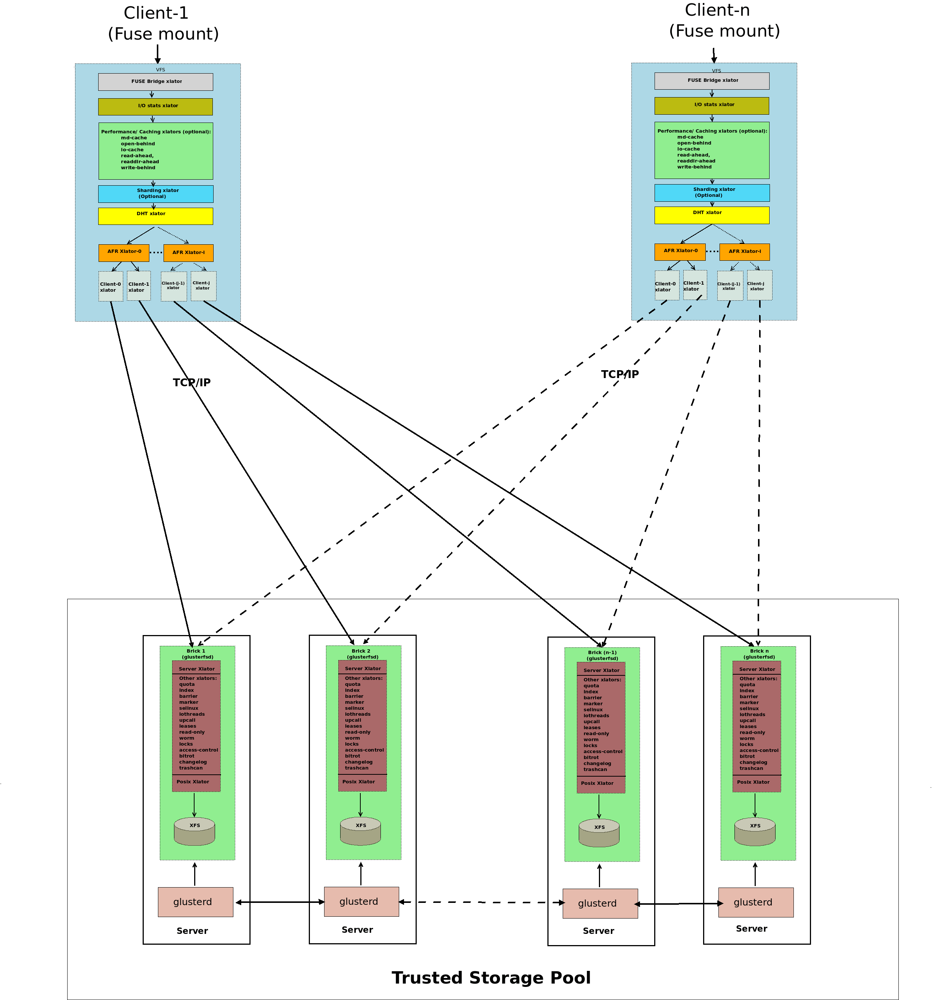

# Distribute file system

## Hadoop Distributed File System [(HDFS)][hdfs]

HDFS是Apache Hadoop生态系统的一部分，最初由Google的GFS（Google File System）论文
启发而来。它设计用于在廉价硬件上存储海量数据，并提供高容错性。HDFS将大文件切分成
多个数据块，并在多个节点上进行分布式存储。它适用于批处理作业，如Hadoop MapReduce
等。

## [Ceph][ceph]

Ceph是一个开源的、自我修复的分布式存储系统，可以通过多个对象存储、块存储和文件系
统接口访问数据。Ceph设计用于在可扩展集群上提供高性能、高可靠性和高可用性。它广泛
用于云计算环境中，支持多个数据中心的复制和容灾。

## [GlusterFS][glusterfs]

GlusterFS是一个分布式文件系统，可以横向扩展到成百上千的服务器。它使用可扩展的存
储池和分布式卷来存储数据。GlusterFS提供文件级别的访问，并支持多种数据复制模式，
以提供高可用性。

[hdfs]: https://hadoop.apache.org/docs/r1.2.1/hdfs_design.html
[ceph]: https://docs.ceph.com/en/quincy/
[glusterfs]: https://docs.gluster.org/en/main/
