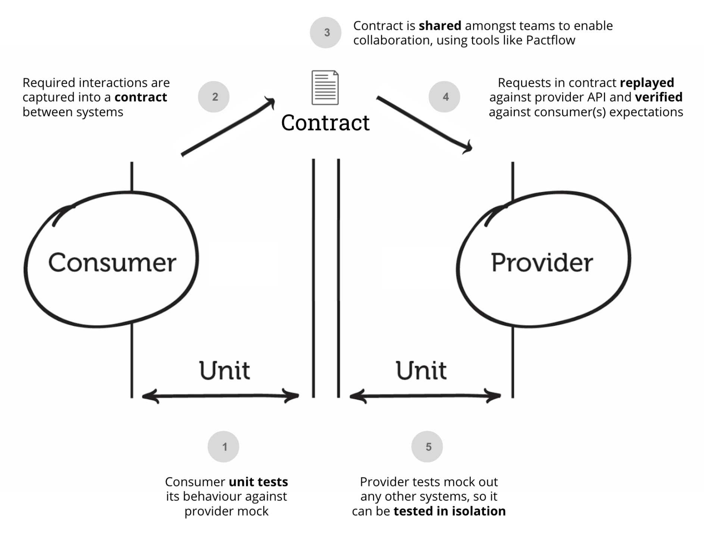

# 契约测试

## 什么是契约测试

当我们讨论契约测试（Consumer Driven Contracts，CDC）时，它是一种软件开发中的测试
方法，旨在确保在不同服务之间的集成中保持一致性和可靠性。

在传统的集成测试中，通常会使用一种中心化的方法，其中一个服务（通常是供应者）提供
一个契约或接口定义，然后其他服务（通常是消费者）编写测试来验证他们的实现是否符合
这个契约。这种方法的问题是，消费者的需求和期望无法完全体现在契约中，因此可能会导
致集成问题。

CDC的方法与之不同，它着重于消费者的需求，并允许消费者定义契约。在CDC中，每个消费
者都可以为其与供应者的交互定义自己的契约。这个契约描述了消费者希望供应者履行的行
为和期望。供应者会根据这些契约编写测试来验证其实现是否符合消费者的要求。这样一
来，消费者和供应者之间的集成问题可以在开发阶段就被发现和解决。

CDC的优势在于它能够提供更好的协作和解耦。消费者可以独立地定义和更新契约，而供应
者则可以根据这些契约来测试和验证他们的实现。这种方式使得不同服务之间的集成更加灵
活和可靠，因为任何变化都会在测试阶段被及时发现并解决。

总结起来，契约测试是一种通过消费者定义契约来确保不同服务之间一致性和可靠性的测试
方法。它提供了更好的协作和解耦，并帮助开发人员在早期发现和解决集成问题。

## 契约测试、单元测试、API测试和集成测试的区别

当涉及到测试方法时，契约测试、单元测试、API测试和集成测试是几种不同的方法，用于
测试软件的不同方面和层次。以下是它们之间的区别：

1. 契约测试（Consumer Driven Contracts）：
   - 契约测试关注不同服务之间的集成，以确保一致性和可靠性。
   - 消费者定义契约，描述他们对供应者的期望和行为。
   - 契约测试通过验证供应者的实现是否符合消费者的契约来发现和解决集成问题。

2. 单元测试（Unit Testing）：
   - 单元测试是对软件中最小的可测试单元（如函数、方法或类）进行测试。
   - 它的目的是验证单个单元的行为是否符合预期，通常在开发过程中进行。
   - 单元测试通过提供输入并检查输出，对单元的各个方面进行验证。

3. API测试（API Testing）：
   - API测试是针对应用程序编程接口（API）进行的测试。
   - 它的目的是验证API的功能、性能和安全性等方面。
   - API测试通常涉及对API端点的请求和响应进行测试，以确保其行为符合规范和预期。

4. 集成测试（Integration Testing）：
   - 集成测试是在多个组件或模块之间进行的测试，以验证它们在集成时是否正常工作。
   - 它的目的是测试组件之间的接口和交互，并发现由于集成而引入的错误。
   - 集成测试可以涵盖不同层次的集成，如模块级别的集成测试、系统级别的集成测试
     等。

## PACT

Pact是一种流行的契约测试框架，它用于在服务之间进行契约测试。Pact框架的核心思想是
消费者和供应者之间的契约定义和验证，以确保服务之间的一致性和可靠性。

Pact框架的主要组成部分包括消费者端和供应者端。下面是它们的功能和工作原理的简要介
绍：

1. 消费者端：
   - 消费者是使用服务的一方，他们使用Pact框架来定义契约。
   - 消费者定义了他们期望从供应者那里接收的请求和响应，并生成一个契约文件。
   - 契约文件描述了消费者的请求和供应者应该响应的预期结果。

2. 供应者端：
   - 供应者是提供服务的一方，他们使用Pact框架来验证契约。
   - 供应者使用消费者生成的契约文件来模拟消费者的请求，并验证他们的服务是否正确
     响应。
   - 如果供应者的实现与契约一致，测试将通过；否则，将报告契约违规或不一致的错
     误。

Pact框架的工作流程如下：

1. 消费者和供应者之间定义契约：消费者根据他们对供应者的期望，定义请求和预期响应
   的契约。

2. 消费者生成契约文件：消费者使用Pact框架生成包含契约信息的文件。这个契约文件将
   被供应者使用。

3. 供应者验证契约：供应者使用契约文件来模拟消费者的请求，并验证他们的服务是否按
   照契约的要求进行响应。

4. 契约测试结果：Pact框架会生成测试报告，显示契约测试的结果。如果契约一致，测试
   通过；否则，将显示契约违规或不一致的错误。

Pact框架的优势包括：

- 提供了一种轻量级且易于使用的契约测试方法。
- 允许消费者和供应者在开发过程中独立地定义和验证契约。
- 通过早期发现和解决集成问题，促进了团队之间的协作和解耦。

## References

- [Contract testing asynchronous messaging with Pact and
  MockK](https://technology.lastminute.com/contract-testing-asynchronous-messaging-pact-junit-mockk/)
- https://www.infoq.cn/article/U8walzaYhwOZQzsVypVj
- [使用契约测试提高分布式系统的质
  量](https://www.infoq.cn/article/contract-testing-spring-cloud-contract)
- [契约测试理论篇](https://xie.infoq.cn/article/1c490dabcb429209b07e5b456)
- [契约测试实践篇](https://xie.infoq.cn/article/56006dcd3893324e02d2e5c88)
- [微服务下的契约测试(CDC)解
  读](https://www.cnblogs.com/jinjiangongzuoshi/p/7815243.html)
- [pact-specification](https://github.com/pact-foundation/pact-specification)
- [契约测试：解决微服务测试的问
  题](https://xie.infoq.cn/article/4a7132566e2f2a032ae9bb0e0)
- [干货时间：聊聊 DevOps 下的技术系列之契约测
  试](https://xie.infoq.cn/article/fd65cc64d9e66edca750d3ded)
- [集成测试（三）：护航微服务集群迭代升
  级](https://time.geekbang.org/column/article/509551)
- [The Practical Test
  Pyramid](https://martinfowler.com/articles/practical-test-pyramid.html)
- [基于契约的开发：通过明确需求优化软件开发流
  程](https://www.infoq.cn/article/g6D7e4ki76V3dRBWkrrK)
- [pact-workshop-go](https://github.com/pact-foundation/pact-workshop-go)
