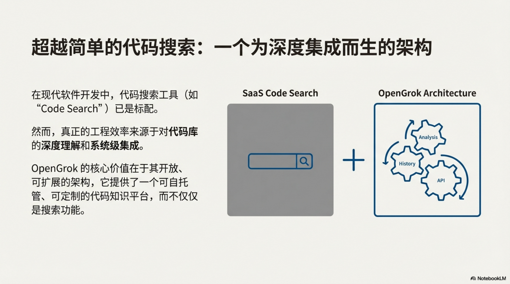
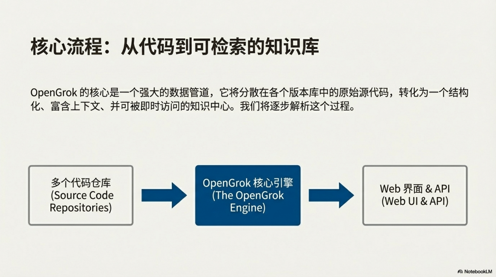
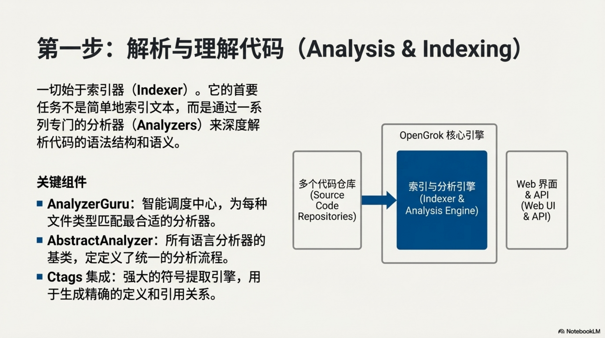
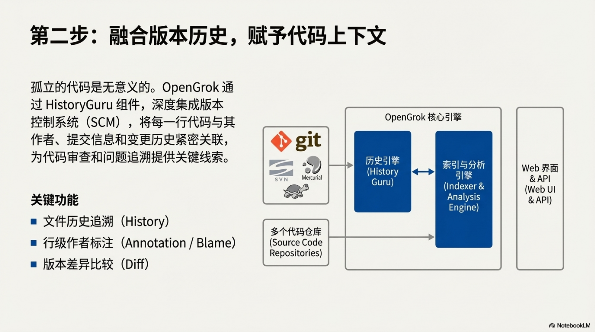
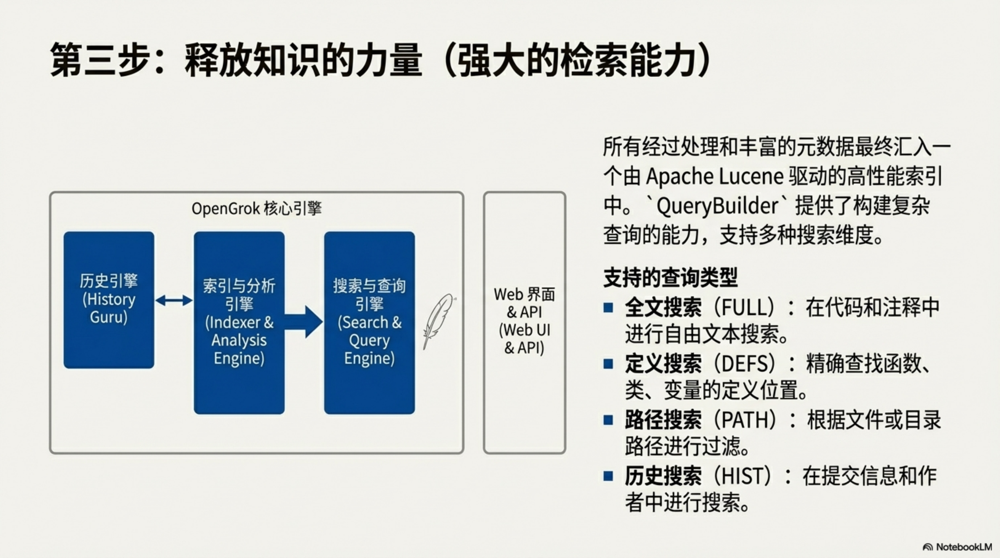
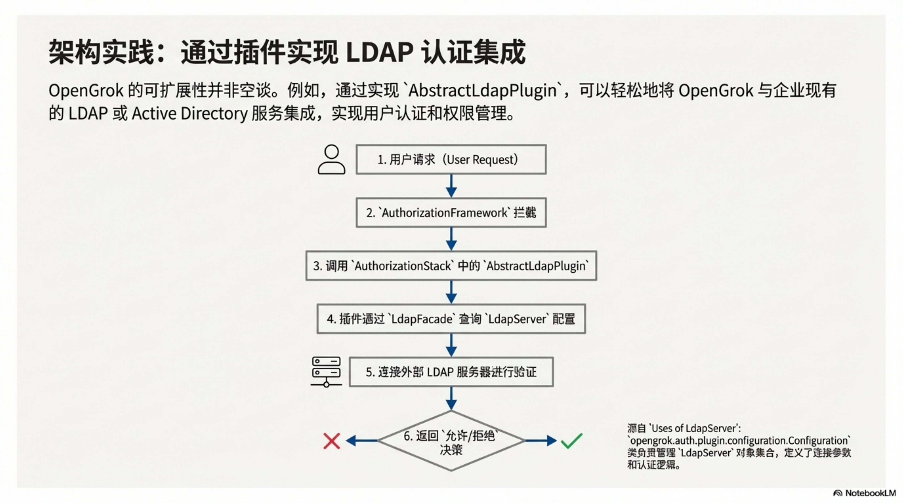

# OpenGrok 企业级架构深度解析：设计、扩展与性能调优

## 目录

- [OpenGrok 企业级架构深度解析：设计、扩展与性能调优](#opengrok-企业级架构深度解析设计扩展与性能调优)
  - [目录](#目录)
  - [1.0 导言：理解海量代码库的战略工具](#10-导言理解海量代码库的战略工具)
  - [2.0 核心架构与设计原则](#20-核心架构与设计原则)
  - [3.0 剖析索引生命周期](#30-剖析索引生命周期)
    - [3.1 历史缓存生成](#31-历史缓存生成)
    - [3.2 Lucene 索引与分析](#32-lucene-索引与分析)
  - [4.0 企业级部署的可扩展性与性能调优](#40-企业级部署的可扩展性与性能调优)
    - [4.1 操作系统与 JVM 优化](#41-操作系统与-jvm-优化)
    - [4.2 应用程序性能调优](#42-应用程序性能调优)
      - [关键索引调优参数](#关键索引调优参数)
    - [4.3 搜索性能策略](#43-搜索性能策略)
  - [5.0 可插拔式安全与授权框架](#50-可插拔式安全与授权框架)
    - [5.1 核心授权插件](#51-核心授权插件)
      - [通用与 LDAP 授权插件](#通用与-ldap-授权插件)
  - [6.0 通过 REST API 实现企业集成](#60-通过-rest-api-实现企业集成)
    - [6.1 程序化管理与配置](#61-程序化管理与配置)
    - [6.2 Suggester 与监控](#62-suggester-与监控)
  - [7.0 代码搜索领域的竞品分析](#70-代码搜索领域的竞品分析)
    - [7.1 OpenGrok vs. Sourcegraph](#71-opengrok-vs-sourcegraph)
      - [功能对比：OpenGrok 与主要替代方案](#功能对比opengrok-与主要替代方案)
  - [8.0 结论：OpenGrok 在大型企业中的战略价值](#80-结论opengrok-在大型企业中的战略价值)

## 1.0 导言：理解海量代码库的战略工具

在现代软件工程领域，管理庞大且分散的代码库是其中一项最重大的挑战。随着系统复杂性
和代码量的增长，开发者在数千个代码库中导航、搜索和理解数百万行代码的能力，会因巨
大的认知负荷而受限。OpenGrok 作为一个成熟的源代码搜索与交叉引用引擎，通过提供一
个高性能框架来促进深层次的代码理解（即“grokking”），从而有效应对这一挑战。

OpenGrok 的历史可以追溯到 Sun Microsystems，最初由 Chandan B.N. 设计，用于安全漏
洞研究。随后，它在 OpenSolaris 项目中被采纳为主要搜索引擎，并在 Oracle 公司收购
Sun 后继续由 Oracle 维护。尽管所有权发生了变更，OpenGrok 始终保持其开源特性，在
通用开发和发布许可证（CDDL）下发布。

OpenGrok 的核心价值主张在于其作为一个精密的源代码搜索和交叉引用引擎，能够帮助开
发者深入理解代码。它不仅仅是一个文本搜索工具，更是一个促进程序理解的强大助手。本
白皮书将深入剖析其底层架构，为企业级部署提供指导。

## 2.0 核心架构与设计原则

要成功地在企业环境中部署 OpenGrok，对其核心组件和设计理念的战略性理解至关重
要。OpenGrok 的技术栈清晰而专注，旨在实现最高的性能和可靠性。

该系统完全用 Java 编写，其强大功能依赖于两个关键的外部技术组件：

1. Apache Lucene：这是 OpenGrok 的索引核心。Lucene 负责创建和管理一个高效的倒排
   索引，使得对海量代码的快速全文搜索成为可能。
2. Universal Ctags：在索引过程的初期，OpenGrok 调用 Universal Ctags 对源代码进行
   语义扫描。此工具能够识别并标记出代码中的函数、类和变量等符号，为后续的交叉引
   用功能奠定基础。需要明确的是，现已停止维护的 Exuberant Ctags 因缺少对现代编程
   语法的解析器而无法满足 OpenGrok 的需求。

一个标准的 OpenGrok 企业级部署通常遵循特定的目录结构，以实现源代码、索引数据和配
置文件的清晰分离。这种结构不仅有利于维护，也对性能优化至关重要：

- 源代码库根（`src`）：此目录存放所有需要被索引的代码库。一个关键的最佳实践
  是，`src` 下的每个直接子目录都会被映射为 OpenGrok 用户界面中的一个独立“项目”。
- 数据根目录（`data`）：这是 OpenGrok 的工作核心区，存放生成的 Lucene 索引、历史
  缓存和交叉引用（xref）文件。考虑到搜索操作的 I/O 密集型特性，强烈建议将 `data`
  目录部署在高性能存储介质上，如固态硬盘（SSD）或闪存。
- 分发目录（`dist`）：包含 OpenGrok 的二进制文件，包括索引器 `opengrok.jar` 和
  Web 应用程序 `source.war`。
- 配置目录（`etc`）：存放作为索引器与 Web 应用之间桥梁的 `configuration.xml` 文
  件，以及日志记录相关的属性文件。
- 日志目录（`log`）：用于存储操作日志。对于监控长时间运行的索引任务而言，这些日
  志是必不可少的。

这种在 `src`、`data` 和 `etc` 之间严格的关注点分离是一个关键的设计选择，它使得代
码、索引和配置可以进行独立的扩展和备份策略，这是企业级容错能力的一项关键要求。理
解了这些静态的架构组件后，我们接下来将深入分析将原始代码转化为可搜索数据库的动态
过程——索引生命周期。

## 3.0 剖析索引生命周期

索引过程是 OpenGrok 的核心机制，它将原始的源代码文本转化为一个结构化、可搜索且包
含丰富交叉引用的数据库。这个生命周期可以被清晰地解构为两个主要阶段。

### 3.1 历史缓存生成

索引的第一步是与源代码管理（SCM）系统进行交互。索引器会查询配置好的代码库（例如
Git、Mercurial、Subversion 等），提取每个文件的完整修订历史。这些历史信息被处理
并存储在 `data` 目录下的历史缓存中，为后续的历史搜索和文件标注功能提供数据支持。
通过将 SCM 历史检索与内容分析解耦，该架构将 I/O 密集型操作（对 SCM 的网络/磁盘访
问）与 CPU 密集型操作（Ctags 解析和 Lucene 索引）分离开来，从而实现了更精细的性
能监控和调优。

### 3.2 Lucene 索引与分析

在历史数据提取完毕后，索引器进入 Lucene 索引阶段。此时，它会调用 Universal Ctags
来分析 `src` 目录中的源文件，生成代表代码语义结构的符号流（tokens）。这些符号、
原始文件内容以及先前生成的历史数据，随后被送入 Lucene 引擎。Lucene 利用这些信息
构建最终的倒排索引，这是实现快速搜索的关键。这个阶段是高度并行的，其并行度通常会
根据可用的 CPU 核心数进行扩展。此并行化是关键的可扩展性特性，但它直接影响内存压
力；每个线程都需要自己的缓冲区，这在索引吞吐量和 JVM 堆要求之间形成了直接的权衡
关系。
将这一过程扩展到大型企业环境中，无疑会带来一系列独特的挑战，这正是我们下一节将要
探讨的主题。

## 4.0 企业级部署的可扩展性与性能调优

当 OpenGrok 的部署规模扩展到处理数百个代码库和数千名用户时，必须进行审慎的系统和
应用程序调优，以确保性能和稳定性。未经优化的系统很容易在企业级负载下遭遇瓶颈。

### 4.1 操作系统与 JVM 优化

在大型部署中，一个首要的故障模式是 `java.io.IOException: error=24`（“打开文件过
多”）。这是因为索引器在分析过程中需要同时打开大量文件句柄，再加上 Java 模块化系
统自身也会默认打开许多 `.jmod` 文件，导致系统资源耗尽。因此，必须为运行 OpenGrok
的用户提升操作系统级别的打开文件数限制，通常建议将 `ulimit -n` 的值增加到至少
`10,240`。

同样关键的是 JVM 内存管理。索引器在分析大量符号时会消耗大量内存。为了防止出现内
存溢出（OutOfMemory）错误，必须通过 `-Xmx` 参数调整 JVM 的最大堆内存。对于中到大
型代码库，`8 GB` 是一个标准的起始值，但对于海量代码库，可能需要将其增加到 `16
GB` 甚至 `32 GB`。

### 4.2 应用程序性能调优

在应用程序层面，Lucene 的 RAM 缓冲区大小是一个重要的调优参数，它通过 `-m` 命令行
选项控制。该缓冲区决定了在将内存中的索引段（segments）刷新到磁盘之前可以缓存多少
数据。对于一个 `8 GB` 的 JVM 堆，将此缓冲区设置为 `256 MB` 是一个合理的起点，这
可以在内存使用和磁盘 I/O 之间取得良好平衡。

在 Web 应用端，提供“输入即搜索”功能的 Suggester 框架可能会成为内存消耗大户。其内
存占用与所有项目中唯一符号的总数成正比。在一个拥有超过 `300` 个项目的大型组织
中，仅 Suggester 数据就可能超过 `4 GB`。为了保持用户界面的响应能力，必须为
Tomcat 等应用服务器配置足够大的堆内存，通常需要 `16 GB` 到 `48 GB`。

架构师必须将 JVM 最大堆内存（`-Xmx`）、RAM 缓冲区大小（`-m`）和线程限制
（`indexingParallelism`）视为一个相互关联的约束三角，而非独立的设置。在没有相应
增加堆内存以防止 OOM 错误和适当扩展 RAM 缓冲区以高效管理段刷新的情况下，激进地增
加线程数以饱和 CPU 是徒劳的。

下表总结了关键的索引调优参数及其对操作的影响：

#### 关键索引调优参数

| 调优参数       | 参数                  | 操作影响                                      |
| -------------- | --------------------- | --------------------------------------------- |
| JVM 最大堆内存 | `-Xmx`                | 在进行大型符号分析时防止内存溢出错误。        |
| RAM 缓冲区大小 | `-m`                  | 控制用于将索引段刷新到磁盘的内存量。          |
| 线程限制       | `indexingParallelism` | 平衡 CPU 饱和度与内存使用率。                 |
| 打开文件数限制 | `ulimit -n`           | 避免在大型项目中出现 IOException 的关键参数。 |
| 历史分块大小   | `historyChunkSize`    | 优化针对 Git/Mercurial 的历史解析性能。       |

### 4.3 搜索性能策略

对于许多用户执行“跨所有项目”搜索的环境，操作系统的文件系统缓存成为一个主要的性能
决定因素。如果 Lucene 索引的总大小超过了可用的物理内存，系统将被迫频繁地从磁盘读
取数据，导致搜索延迟从毫秒级飙升至数十秒。根据 GitHub Issue #1116 中报告的一个真
实案例，搜索时间从 `100–300` 毫秒增加到了惊人的 `15,000–20,000` 毫秒。

为了解决这个问题，一种有效的策略是使用 `vmtouch` 之类的工具来“预热”文件系统缓
存。在每次重新索引完成后，可以运行一个脚本，强制将 `data` 目录中的相关索引文件加
载到系统内存中。这能极大地减少磁盘 I/O，显著降低搜索延迟，为用户提供流畅的体验。

在优化了性能之后，保障 OpenGrok 实例的安全性是下一个逻辑步骤。

## 5.0 可插拔式安全与授权框架

OpenGrok 采用了“安全设计”理念，其框架将用户身份识别（认证）与访问规则执行（授
权）明确分离。这种设计通过一个灵活的、基于插件的框架实现，为企业提供了高度可定制
的安全集成能力。

OpenGrok 的授权系统在架构上模仿了可插拔认证模块（PAM）系统。它以一个插件栈的形式
运作，对于每个传入的请求，栈中的插件会按顺序进行评估。每个插件都被赋予一个控制标
志，该标志决定了其决策（成功或失败）如何影响整个授权链：

- REQUIRED：该插件必须成功，但即使成功，后续插件仍会继续评估。
- REQUISITE：该插件必须成功，如果失败，则立即拒绝访问，不再评估后续插件。
- SUFFICIENT：如果该插件成功，则立即授予访问权限，不再评估后续插件（除非前面有失
  败的 REQUIRED 插件）。
- OPTIONAL：该插件的成功与否不直接影响最终决策，通常用于记录或设置上下文。

在典型的企业集成中，认证过程通常被卸载到反向代理（如 NGINX）或 Servlet 容器（如
Tomcat）。这些前端系统完成用户认证后，通过标准的 HTTP 头将用户身份信息传递给
OpenGrok，然后由授权插件栈使用这些信息来做出访问控制决策。

### 5.1 核心授权插件

OpenGrok 提供了一系列核心插件，以支持常见的授权场景，特别是与企业级目录服务的集
成。

#### 通用与 LDAP 授权插件

| 插件名称              | 主要功能      | 关键配置细节                                                                                                                                                             |
| --------------------- | ------------- | ------------------------------------------------------------------------------------------------------------------------------------------------------------------------ |
| `UserPlugin`          | 身份提取      | 配置解码器以从特定的 HTTP 头中提取用户身份，例如，使用 `MellonHeaderDecoder` 解析 `MELLON_email` 头，或使用 `UserPrincipalDecoder` 解析 HTTP Basic Auth 提供的用户信息。 |
| `UserWhiteListPlugin` | 简单访问控制  | 根据一个纯文本文件中的白名单来验证用户。                                                                                                                                 |
| `LdapUserPlugin`      | LDAP 用户查找 | 从 LDAP 服务器查询用户属性，并为当前会话缓存这些属性。                                                                                                                   |
| `LdapFilterPlugin`    | 属性强制执行  | 如果用户不匹配指定的 LDAP 过滤器，则拒绝访问。                                                                                                                           |

与 LDAP 或 Active Directory 的集成是企业部署的标准实践。OpenGrok 的 LDAP 插件配
置被方便地存放在一个独立的 YAML 文件中，这使得管理复杂的目录服务连接变得简单。该
配置支持多种企业级特性，包括连接池、多个故障转移服务器以及通过 LDAPS 实现的加密
通信。

在建立了安全框架后，下一步是通过 API 实现 OpenGrok 与企业自动化工作流的无缝集
成。

## 6.0 通过 REST API 实现企业集成

在现代的 CI/CD 和 DevOps 工作流中，开发者工具的程序化交互能力已成为一项战略必
需。OpenGrok 通过其 v1 REST API 满足了这一需求，为自动化和系统集成提供了强大的接
口。

### 6.1 程序化管理与配置

OpenGrok 的 REST API（通常位于 `/api/v1/`）允许管理员以编程方式执行大多数管理任
务，而无需直接访问服务器的文件系统。关键的端点包括：

- `/configuration`：自动化调用此端点是任何成熟部署中不可或缺的最佳实践。它允许
  CI/CD 管道在重新索引完成后通知 Web 应用程序强制重载配置，从而消除 Web 前端因配
  置过时而提供陈旧搜索结果的风险。
- `/projects`：此端点是实现动态、临时环境的基石。它允许 CI 系统以编程方式将特性
  分支添加到中央代码浏览器中进行审查，并在合并后将其删除，从而防止索引膨胀。
- `/messages`：该端点允许向 OpenGrok 的用户界面注入系统范围的通知，可用于告知用
  户计划内维护或当前索引队列的状态。

### 6.2 Suggester 与监控

API 还提供了对核心功能的程序化访问。Suggester API 允许外部工具查询驱动搜索栏自动
补全功能的数据。

至关重要的是，`/monitoring` 端点以 Prometheus 格式提供关键的系统指标。这使得组织
能够将 OpenGrok 无缝集成到现有的可观察性平台（如 Grafana）中，从而可视化搜索吞吐
量、延迟百分位数和索引器健康状况等关键性能指标。

理解了如何将 OpenGrok 集成到自动化流程中后，评估其在更广泛市场中的地位变得尤为重
要。

## 7.0 代码搜索领域的竞品分析

虽然 OpenGrok 是一个功能强大的工具，但全面的评估需要理解其在代码搜索市场中相对于
其他解决方案的定位。

### 7.1 OpenGrok vs. Sourcegraph

Sourcegraph 是 OpenGrok 在现代商业领域中最主要的竞争对手。它提供了一个更现代化的
用户界面，并通过其 AI 助手 Cody 深度集成了大型语言模型，能够基于代码库回答开发者
的问题。对于希望获得托管服务或与 GitHub 和 GitLab 等云环境深度集成的组织来
说，Sourcegraph 通常是首选。

相比之下，OpenGrok 对于那些要求对数据进行绝对本地控制、在海量本地代码库上追求极
致性能，以及需要支持云原生工具所不支持的各种传统 SCM 系统（如 ClearCase）的组织
而言，仍然是最佳选择。其在处理复杂、异构的本地环境中展现出无与伦比的优势。

下表总结了 OpenGrok 与其主要替代方案之间的关键功能差异：

#### 功能对比：OpenGrok 与主要替代方案

| 功能     | OpenGrok               | Sourcegraph                  | Zoekt                    | Livegrep                 |
| -------- | ---------------------- | ---------------------------- | ------------------------ | ------------------------ |
| 搜索基础 | 词法分析与语义符号     | 基于三元模型的正则表达式，AI | 基于三元模型的正则表达式 | 基于三元模型的正则表达式 |
| 交叉引用 | 原生（Ctags）          | LSIF / SCIP                  | 有限                     | 无                       |
| SCM 支持 | 非常广泛（含传统系统） | Git, SVN, HG                 | Git                      | Git                      |
| 部署方式 | 本地部署               | SaaS & 本地部署              | 本地部署                 | 本地部署                 |
| 用户界面 | 功能性 / 传统          | 现代化 / 直观                | 极简                     | 极简                     |

现在，让我们对本次白皮书的发现进行总结。

## 8.0 结论：OpenGrok 在大型企业中的战略价值

OpenGrok 在快速发展的开发者工具领域能够经久不衰，这充分证明了其架构的稳健性，以
及它专注于解决一个特定且高价值的问题：实现对代码的深层次理解。它的持久 relevance
源于其对企业级现实的深刻把握。

本白皮书的分析表明，OpenGrok 的价值源于其精心设计的、基于 Java 和 Lucene 的核
心，以及对企业级部署至关重要的可扩展性和可调优性。虽然现代替代品引入了 AI 驱动的
功能和更华丽的界面，但 OpenGrok 对传统 SCM 系统的广泛支持并非过时特性，而是一项
战略资产。对于正在经历长达数十年的数字化转型、技术栈异构复杂的大型企业而言，这种
能力是不可或缺的。当面对包含数十种不同 SCM 系统和数百万文件的复杂环境
时，OpenGrok 的能力仍然是无与伦比的。它不仅仅是一个搜索程序，更是一个整体的代码
浏览器和分析引擎，这正是其战略价值所在。
