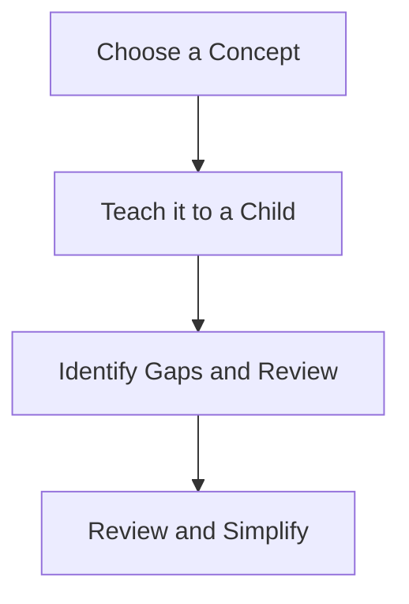

# FEYNMAN TECHNIQUE

The Feynman Technique is a powerful learning method named after Richard Feynman,
a renowned physicist known for his ability to simplify complex concepts and
explain them in a clear and understandable way. The technique revolves around
four essential steps:

1. Choose a Concept: Select a topic or concept you want to learn or understand
   better. It could be anything from a scientific concept to a historical event
   or even a skill you want to master.

1. Teach it to a Child: Pretend you are explaining the concept to a young child
   who has no prior knowledge of the subject. Use simple language, avoid jargon,
   and break down complex ideas into easy-to-understand terms. Teaching to a
   "child" helps you identify any gaps in your understanding and forces you to
   simplify the concept.

1. Identify Gaps and Review: As you teach the concept to your imaginary "child,"
   pay attention to the areas where you struggle to explain clearly or where you
   find gaps in your knowledge. Make note of these areas, as they indicate what
   you need to review and study more thoroughly.

1. Review and Simplify: Go back to your study materials, textbooks, or resources
   and review the areas you identified as challenging or lacking. Try to
   simplify the concept even further in your own words. This step reinforces
   your understanding and helps you internalize the information deeply.
