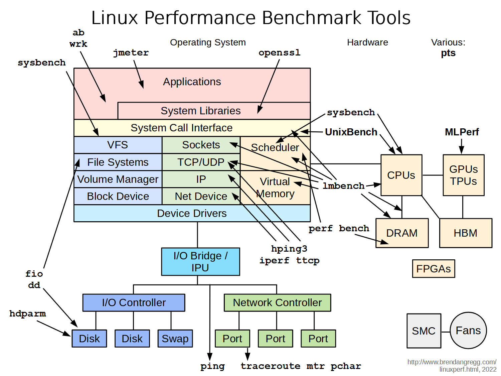
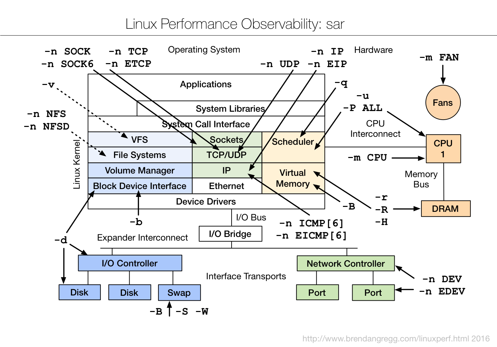
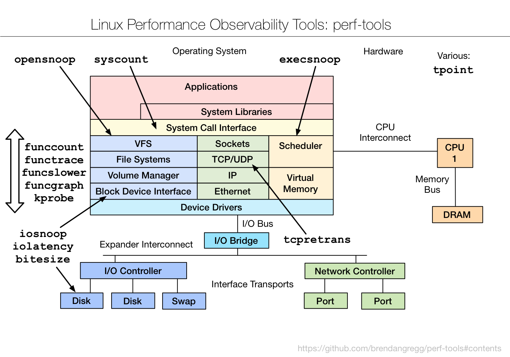

# Linux performance tuning tools

All the pictures are collect from Brendan Gregg's
[blog](https://www.brendangregg.com/).

## Linux Performance tuning tools

## Linux Benchmarking tools

## Linux observability tools

### Sar

## Perf tools

## BPF tracing tools

## BPF performance tools

