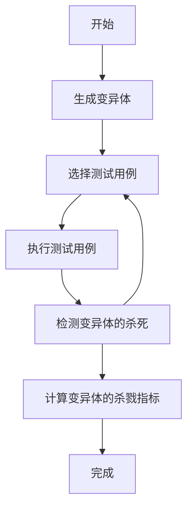

# Mutation testing

## What

Mutation testing is the practice of making better code by introducing bugs.

变异测试是一种软件测试技术，旨在评估测试用例的质量和发现代码中的缺陷。它的基本思
想是通过对程序代码做出小的修改，生成许多变异体（即变异版本），然后使用这些变异体
来执行测试用例。变异体在源代码中引入了有意义的错误或缺陷，以模拟潜在的程序错误。

## How

变异测试的步骤如下：

1. 变异体生成：通过对源代码进行一系列小的改动（例如插入、删除、修改语句），生成
一组变异体。每个变异体都代表了对原始代码的一种变异。

1. 测试用例执行：对每个变异体应用相同的测试用例集合。测试用例是设计用来覆盖不同
程序路径和功能的输入数据。

1. 检测变异体的杀死：如果一个变异体被某个测试用例杀死，意味着测试用例能够揭示变
异体中引入的错误。这个测试用例被称为"杀手测试用例"。

1. 变异体的杀戮指标：根据被杀死的变异体数量和总变异体数目，计算变异体的杀戮指
标。这个指标表示测试用例集合对于检测潜在错误的效能。

通过执行变异测试，您可以获得以下优点：

- 发现测试用例不足之处：变异测试可以检测测试用例集合对于捕捉潜在错误的覆盖程度。
如果某些变异体很少被杀死，说明测试用例需要更好地覆盖相应的代码区域。

- 检测代码缺陷：通过引入有意义的错误和缺陷，变异测试可以帮助发现代码中存在的潜在
问题。每个变异体都代表了一种错误类型，可以评估系统对这些错误的检测能力。

- 提高测试用例质量：变异测试可以帮助识别和改进测试用例的质量，从而提高软件系统的
整体可靠性和稳定性。

## 测试框架

- [Java-Pitest](https://github.com/hcoles/pitest)
- [go-mutesting](https://github.com/zimmski/go-mutesting)

## References

- https://en.wikipedia.org/wiki/Mutation_testing
- https://github.com/theofidry/awesome-mutation-testing
- https://dev.to/guilhermeguitte/mutation-testing-on-go-1lbf
- https://pitest.org/quickstart/mutators/
- https://time.geekbang.org/column/article/519677
- https://www.infoq.cn/article/test-coverage-rate-role
